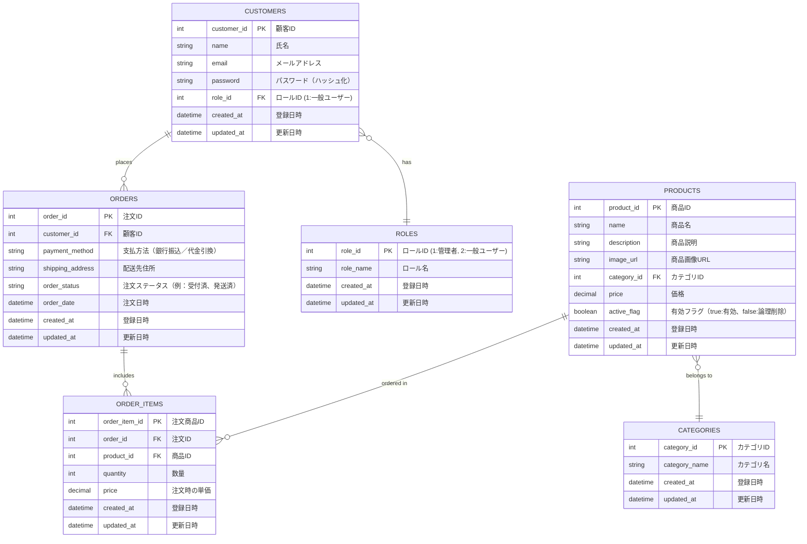

```mermaid

erDiagram
    CUSTOMERS ||--o{ ORDERS : "places"
    CUSTOMERS }o--|| ROLES : "has"
    PRODUCTS }o--|| CATEGORIES : "belongs to"
    ORDERS ||--o{ ORDER_ITEMS : "includes"
    PRODUCTS ||--o{ ORDER_ITEMS : "ordered in"

    CUSTOMERS {
        int customer_id PK "顧客ID"
        string name "氏名"
        string email "メールアドレス"
        string password "パスワード（ハッシュ化）"
        int role_id FK "ロールID (1:一般ユーザー)"
        datetime created_at "登録日時"
        datetime updated_at "更新日時"
    }
    ROLES {
        int role_id PK "ロールID (1:管理者, 2:一般ユーザー)"
        string role_name "ロール名"
        datetime created_at "登録日時"
        datetime updated_at "更新日時"
    }
    PRODUCTS {
        int product_id PK "商品ID"
        string name "商品名"
        string description "商品説明"
        string image_url "商品画像URL"
        int category_id FK "カテゴリID"
        decimal price "価格"
        boolean active_flag "有効フラグ（true:有効、false:論理削除）"
        datetime created_at "登録日時"
        datetime updated_at "更新日時"
    }
    CATEGORIES {
        int category_id PK "カテゴリID"
        string category_name "カテゴリ名"
        datetime created_at "登録日時"
        datetime updated_at "更新日時"
    }
    ORDERS {
        int order_id PK "注文ID"
        int customer_id FK "顧客ID"
        string payment_method "支払方法（銀行振込／代金引換）"
        string shipping_address "配送先住所"
        string order_status "注文ステータス（例：受付済、発送済）"
        datetime order_date "注文日時"
        datetime created_at "登録日時"
        datetime updated_at "更新日時"
    }
    ORDER_ITEMS {
        int order_item_id PK "注文商品ID"
        int order_id FK "注文ID"
        int product_id FK "商品ID"
        int quantity "数量"
        decimal price "注文時の単価"
        datetime created_at "登録日時"
        datetime updated_at "更新日時"
    }
```