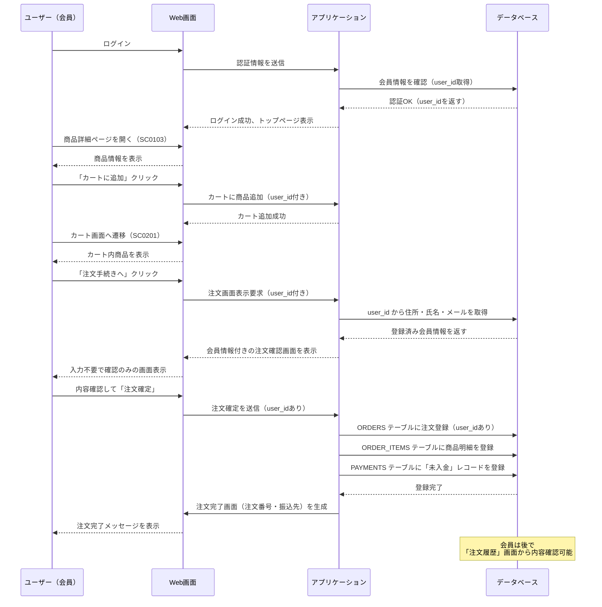
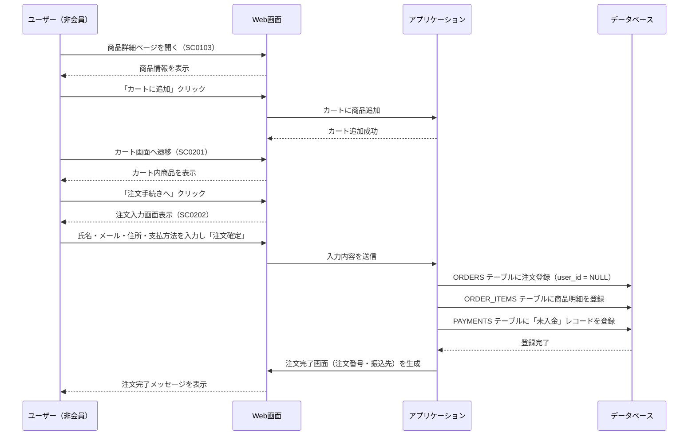
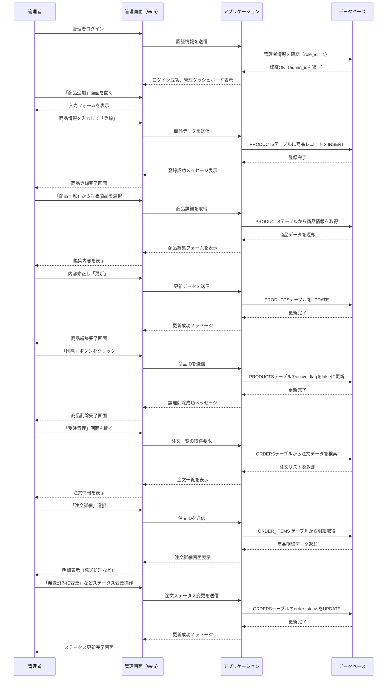

- 登録済ユーザー

```mermaid
sequenceDiagram
    participant User as ユーザー（会員）
    participant UI as Web画面
    participant Backend as アプリケーション
    participant DB as データベース

    User->>UI: ログイン
    UI->>Backend: 認証情報を送信
    Backend->>DB: 会員情報を確認（user_id取得）
    DB-->>Backend: 認証OK（user_idを返す）
    Backend-->>UI: ログイン成功、トップページ表示

    User->>UI: 商品詳細ページを開く（SC0103）
    UI-->>User: 商品情報を表示

    User->>UI: 「カートに追加」クリック
    UI->>Backend: カートに商品追加（user_id付き）
    Backend-->>UI: カート追加成功

    User->>UI: カート画面へ遷移（SC0201）
    UI-->>User: カート内商品を表示

    User->>UI: 「注文手続きへ」クリック
    UI->>Backend: 注文画面表示要求（user_id付き）

    Backend->>DB: user_id から住所・氏名・メールを取得
    DB-->>Backend: 登録済み会員情報を返す
    Backend-->>UI: 会員情報付きの注文確認画面を表示
    UI-->>User: 入力不要で確認のみの画面表示

    User->>UI: 内容確認して「注文確定」

    UI->>Backend: 注文確定を送信（user_idあり）
    Backend->>DB: ORDERS テーブルに注文登録（user_idあり）
    Backend->>DB: ORDER_ITEMS テーブルに商品明細を登録
    Backend->>DB: PAYMENTS テーブルに「未入金」レコードを登録
    DB-->>Backend: 登録完了

    Backend->>UI: 注文完了画面（注文番号・振込先）を生成
    UI-->>User: 注文完了メッセージを表示

    Note over DB: 会員は後で<br>「注文履歴」画面から内容確認可能
```

&nbsp;
- 非登録ユーザー

```mermaid
sequenceDiagram
    participant User as ユーザー（非会員）
    participant UI as Web画面
    participant Backend as アプリケーション
    participant DB as データベース

    User->>UI: 商品詳細ページを開く（SC0103）
    UI-->>User: 商品情報を表示

    User->>UI: 「カートに追加」クリック
    UI->>Backend: カートに商品追加
    Backend-->>UI: カート追加成功

    User->>UI: カート画面へ遷移（SC0201）
    UI-->>User: カート内商品を表示

    User->>UI: 「注文手続きへ」クリック
    UI-->>User: 注文入力画面表示（SC0202）

    User->>UI: 氏名・メール・住所・支払方法を入力し「注文確定」

    UI->>Backend: 入力内容を送信
    Backend->>DB: ORDERS テーブルに注文登録（user_id = NULL）
    Backend->>DB: ORDER_ITEMS テーブルに商品明細を登録
    Backend->>DB: PAYMENTS テーブルに「未入金」レコードを登録
    DB-->>Backend: 登録完了

    Backend->>UI: 注文完了画面（注文番号・振込先）を生成
    UI-->>User: 注文完了メッセージを表示
```
&nbsp;
- 管理者

```mermaid
sequenceDiagram
    participant Admin as 管理者
    participant AdminUI as 管理画面（Web）
    participant Backend as アプリケーション
    participant DB as データベース

    Admin->>AdminUI: 管理者ログイン
    AdminUI->>Backend: 認証情報を送信
    Backend->>DB: 管理者情報を確認（role_id = 1）
    DB-->>Backend: 認証OK（admin_idを返す）
    Backend-->>AdminUI: ログイン成功、管理ダッシュボード表示

    %% --- 商品追加処理 ---
    Admin->>AdminUI: 「商品追加」画面を開く
    AdminUI-->>Admin: 入力フォームを表示

    Admin->>AdminUI: 商品情報を入力して「登録」
    AdminUI->>Backend: 商品データを送信
    Backend->>DB: PRODUCTSテーブルに商品レコードをINSERT
    DB-->>Backend: 登録完了
    Backend-->>AdminUI: 登録成功メッセージ表示
    AdminUI-->>Admin: 商品登録完了画面

    %% --- 商品編集処理 ---
    Admin->>AdminUI: 「商品一覧」から対象商品を選択
    AdminUI->>Backend: 商品詳細を取得
    Backend->>DB: PRODUCTSテーブルから商品情報を取得
    DB-->>Backend: 商品データを返却
    Backend-->>AdminUI: 商品編集フォームを表示
    AdminUI-->>Admin: 編集内容を表示

    Admin->>AdminUI: 内容修正し「更新」
    AdminUI->>Backend: 更新データを送信
    Backend->>DB: PRODUCTSテーブルをUPDATE
    DB-->>Backend: 更新完了
    Backend-->>AdminUI: 更新成功メッセージ
    AdminUI-->>Admin: 商品編集完了画面

    %% --- 商品削除処理（論理削除） ---
    Admin->>AdminUI: 「削除」ボタンをクリック
    AdminUI->>Backend: 商品IDを送信
    Backend->>DB: PRODUCTSテーブルのactive_flagをfalseに更新
    DB-->>Backend: 更新完了
    Backend-->>AdminUI: 論理削除成功メッセージ
    AdminUI-->>Admin: 商品削除完了画面

    %% --- 受注管理処理 ---
    Admin->>AdminUI: 「受注管理」画面を開く
    AdminUI->>Backend: 注文一覧の取得要求
    Backend->>DB: ORDERSテーブルから注文データを検索
    DB-->>Backend: 注文リストを返却
    Backend-->>AdminUI: 注文一覧を表示
    AdminUI-->>Admin: 注文情報を表示

    Admin->>AdminUI: 「注文詳細」選択
    AdminUI->>Backend: 注文IDを送信
    Backend->>DB: ORDER_ITEMS テーブルから明細取得
    DB-->>Backend: 商品明細データ返却
    Backend-->>AdminUI: 注文詳細画面表示
    AdminUI-->>Admin: 明細表示（発送処理など）

    Admin->>AdminUI: 「発送済みに変更」などステータス変更操作
    AdminUI->>Backend: 注文ステータス変更を送信
    Backend->>DB: ORDERSテーブルのorder_statusをUPDATE
    DB-->>Backend: 更新完了
    Backend-->>AdminUI: 更新成功メッセージ
    AdminUI-->>Admin: ステータス更新完了画面
```