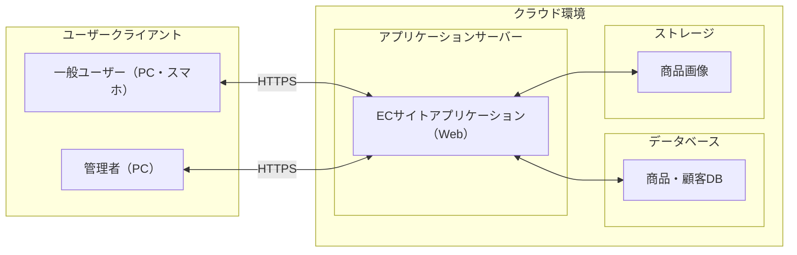
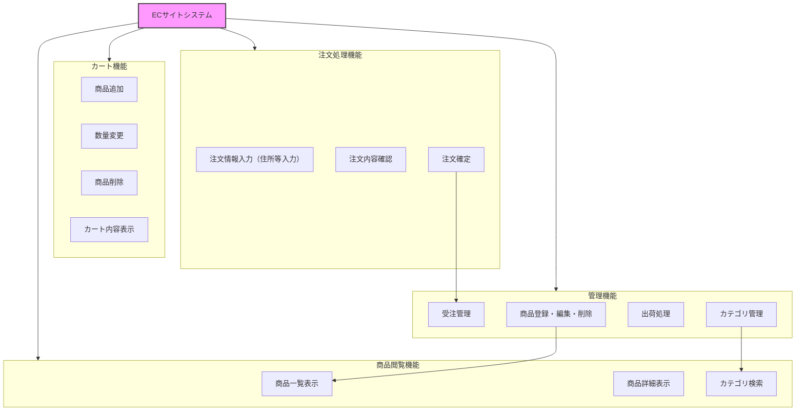
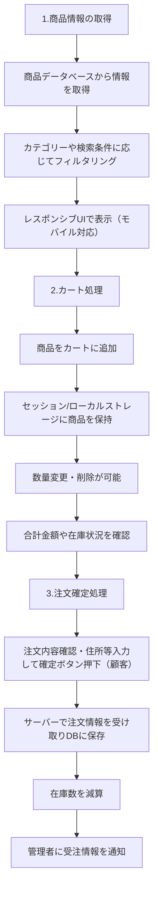
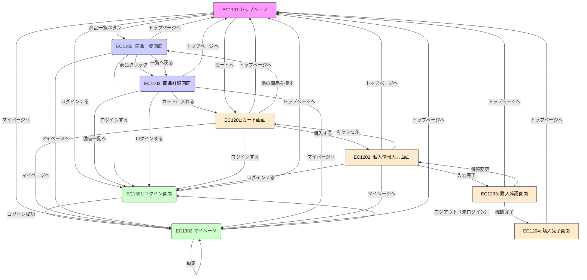
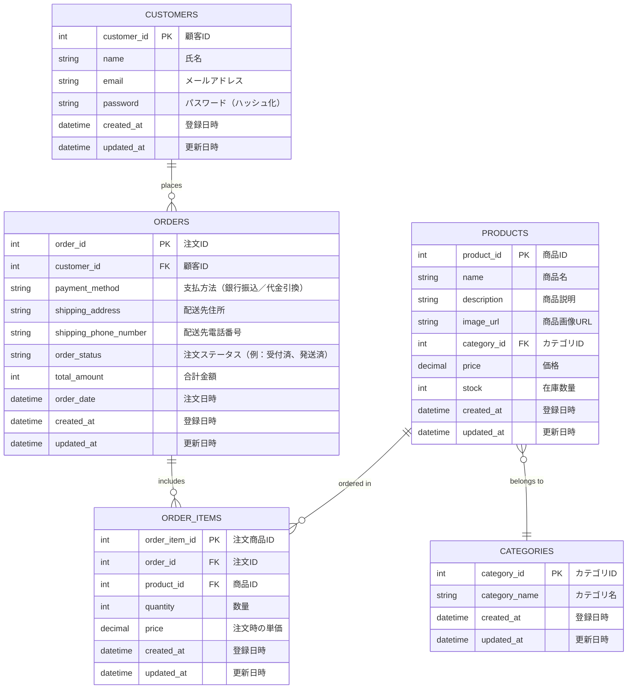

# ECサイト 基本設計書 

| ドキュメントバージョン | 1.1 |  
|---|---|
| 作成日 | 2025年7月2日 | 
| 作成チーム | Popcorn | 
| 承認者 | 株式会社〇〇 〇〇様 | 
| 更新履歴 | 2025/07/02 : 初版作成 : Popcorn | 
| 更新履歴 | 2025/07/03 : 細部の修正 : Popcorn|
| 更新履歴 | 2025/07/04 : 細部の修正 : Popcorn|
| 更新履歴 | 2025/07/07 : 細部の修正 : Popcorn | 

## 1. はじめに 
### 1.1 本書の目的 
本書は、株式会社〇〇のECサイト新規構築プロジェクトにおける基本設計の内容を定義するものである。要件定義書で定められた要件に基づき、システムの全体構成、主要な機能、画面、データ、非機能要件への対応方針などを明確にし、後続の詳細設計、実装、テスト工程のインプットとすることを目的とする。 

### 1.2 プロジェクト概要 
より多くの顧客に商品を届けるため、新たにECサイトを構築し、販路の拡大とブランドの価値向上を目指す。本プロジェクトはその第一歩として、基本機能を備えたECサイトを短期間で立ち上げるものである。 

### 1.3 前提知識 
株式会社〇〇は、実店舗でデザイン性の高い雑貨（文房具、キッチン小物等）を販売しているが、販売地域が限られ、新規顧客の獲得に課題を抱えていた。また、SNSでの個別対応による受注は、工数がかかり効率が悪いという問題もある。 
 

## 2. システム概要 
### 2.1 システム目的 
- オンライン販売チャネルの新規構築により、顧客の購入利便性を高める   
- 商品の魅力が伝わる、シンプルかつ洗練されたデザインのWebサイトを提供する   
- スマートフォンからも快適に利用できるECサイトを構築する   

### 2.2 対象ユーザー 
- 管理者：商品登録・更新、受注管理、出荷処理、売上管理、サイト設定等を行う。主にクライアント企業の担当者が想定される。 
- 一般利用者：オンライン販売サイトを通じて商品検索・閲覧・購入を行うエンドユーザー。 

### 2.3 システム構成図 
システム全体のハードウェア、ソフトウェア、ネットワーク構成。 

### 2.4. 外部インターフェース概要
外部インターフェースに関しては、利用しない。

## 3. 機能設計 
### 3.1 機能一覧  
| 機能ID | 機能名         | 概要                         | MoSCoW | 備考             |
| ---- | ----------- | -------------------------- | ------ | -------------- |
| F001 | 商品一覧表示機能    | 商品をカテゴリ別に一覧表示。検索・絞り込み機能を含む | Must   | UI/UX・操作性にも関係  |
| F002 | 商品詳細表示機能    | 写真、価格、説明、素材など詳細情報を表示       | Must   | 商品情報の訴求力強化     |
| F003 | カート機能       | 複数商品をカートに入れてまとめて購入可能       | Must   | 非会員でも利用可       |
| F004 | 購入機能        | 注文確定までのフロー。決済は除く           | Must   | 在庫管理や管理者処理と連動  |
| F005 | 管理画面機能      | 商品登録・更新、受注管理などを行う管理者用画面    | Should | クライアント企業が利用    |
| F006 | カテゴリー別表示    | 商品をカテゴリー単位で分類・表示           | Should | 商品一覧機能と連動      |
| F007 | 会員登録／ログイン機能 | ユーザーが住所や履歴を保存可能。任意登録       | Could  | 将来的に購入履歴機能と連携  

 
### 3.2 機能構成図 
機能間の関連性や階層構造を示した図。 
ECサイトシステムのURL:https://www.〇〇.co.jp
- 商品閲覧機能：/api/products
- カート機能：/api/cart
- 注文処理機能：/api/orders
- 管理機能：/api/admin

### 3.3 主要機能フロー 
特に重要な機能について、処理の流れを示した図や説明（注文処理フロー）。 

**1. 商品情報の取得**
- 機能: 商品一覧・詳細表示、カテゴリー別表示 
- 処理:
  ①商品データベースから情報を取得 
②カテゴリーや検索条件に応じてフィルタリング 
③モバイル対応のレスポンシブUIで表示 

**2. カート処理**
- 機能: カートに追加、カート内編集 
- 処理: 
①セッションまたはローカルストレージに商品情報を保持
②数量変更・削除などの操作を可能にする 
③合計金額や在庫状況の確認 

**3. 注文確定処理**
- 機能: 注文確定（決済機能なし） 
- 処理: 
①顧客が注文内容を確認し、確定ボタンを押す 
②サーバー側で注文情報を受け取り、DBに保存 
③在庫数を減算 
④管理者向けに受注情報を通知 

## 4. 画面設計 
### 4.1 画面一覧 
| 画面ID | 画面名 | 概要 | 機能ID | 備考 |
|---|---|---|---|---|
| EC1101 | トップページ |オンライン販売サイトの起点となる画面 | F007|サイトのブランドイメージを伝えるバナーを配置し、商品一覧やカート画面等に遷移しやすい構成 |
| EC1102 | 商品一覧画面 |オンライン販売サイトに登録されている商品を一覧表示する画面 |F001|商品はカテゴリ別に表示され、キーワード検索やカテゴリ絞り込み、在庫数の表示、価格順価格順並び替えなどフィルター機能を配置 |
| EC1103 | 商品詳細画面 |選択した商品の詳細情報を表示 |F002 |価格、商品説明、在庫数、画像、レビューなどを確認可能。「カートに入れる」ボタンを設置 |
| EC1201 | カート画面 |ユーザーが選んだ商品を一覧表示 |F003 |数量変更や削除が可能。購入手続き（レジに進む）への導線を提供。 |
| EC1202 | 情報入力画面 |商品購入時に、購入者の氏名・住所・連絡先などを入力する画面 | F004|ログインしていないユーザーに対しては、会員登録せずに購入できる「ゲスト購入」として、配送・連絡に必要な個人情報を収集する。  |
| EC1203 | 購入確認画面 |配送先情報、支払方法、注文内容の最終確認を行う画面 |F004 |「購入確定」ボタンで注文を完了させる。 |
| EC1204 | 購入完了画面 |注文処理完了後に表示される画面 | F004|注文番号や確認メール送信の案内を表示。トップページやマイページへのリンクを設置。  |
| EC1301 | ログイン画面 |既に登録済みのユーザーが、メールアドレスとパスワードを入力してログインする画面 |F007 |マイページや購入手続きなど、会員専用機能にアクセスするための入り口となる。 |
| EC1302 | マイページ |ログイン中のユーザーが、自身のアカウント情報を確認・管理できる画面 |F007 |商品カードには、商品画像、商品名、価格を含み、「詳細」から商品詳細画面（EC1103）への導線となる。   |
| EC2101 | 管理者向けトップページ |管理者がログインするための認証画面 | F005 |メールアドレスとパスワードの入力フォームを提供 |
| EC2102 | 商品管理画面 |録済み商品を一覧表示・検索・絞り込みできる画面 |F005 |編集・削除ボタン付き。商品追加画面へのリンクも設置。  |
| EC2103 | 商品登録・編集画面 |商品情報（名前、価格、在庫数、説明、画像など）を新規登録・編集できる画面 |F005 |登録済み商品の内容変更も可能。 |
| EC2104 | 受注管理画面 |ユーザーからの注文一覧を表示し、注文の詳細確認、出荷状況の更新などを行う画面 |F005 |検索・絞り込み機能も提供。 |
| EC2201 | ユーザ管理画面 |会員登録済みのユーザーを一覧・検索・管理するための管理者用画面 | F005|個々のユーザー情報の確認や編集、強制退会処理などを行う。 |
| EC2202 | サイト設定画面 |ECサイト全体の設定を管理する画面 | F005|営業日、消費税率、メールテンプレート、バナー画像などの基本的なサイト運用に関わる項目を設定できる。 |
|  | (その他、必要に応じて画面を追加)  | | ||

### 4.2 画面遷移図 
画面間の遷移の流れを示した図。 

### 4.3 UI/UX基本方針 
画面設計における基本的な考え方、デザイン原則など。 
- **シンプルさ**: ECサイトとしての主目的である商品閲覧→購入を阻害しないよう、不要な情報や要素は極力省き、直感的なナビゲーション構成とする。トップページから商品一覧/詳細/カートへの導線は明確にし、購入までをスムーズにできるよう設計。非会員でも購入可能なフローを重視。 
- **一貫性**: ボタンの配置、フォントサイズ、ラベル文言、エラーメッセージの表示形式などを全画面で共通のスタイルを使用し、システム全体で統一する。 
- **視認性**: 白を基調としたデザインで、清潔感とブランドイメージの両立を図る。フォントは可読性の高いものを使用。サイズや行間はスマートフォンでも見やすいバランスに調整。コントラスト比、文字サイズ、カラーだけで状態を表さないなどアクセシビリティに配慮。 
- **効率性と操作負担の軽減**: 商品一覧→カート→購入などよく使う操作を最小のステップで完結できるよう設計。入力フォームは自動入力や郵便番号による住所の補完など入力支援の導入。ログイン済ユーザーには情報の自動補完を行い、購入の高速化を目指す。 
- **フィードバック**: ユーザーの操作に対して、即時に視覚的・文言によるフィードバックを明確に表示。完了形の画面では、明確に結果（成功/失敗）を表示し、次のアクション（トップページへ戻る等）を提示。 
- **モバイルファースト対応**: 主な利用端末としてスマートフォンを重視し、タッチ操作と画面サイズに最適化されたレイアウト・ナビゲーションを設計。PC/スマホいずれでも破綻しない表示と操作性を確保。 
- **ブランドイメージとの整合**: デザイン性の高い雑貨を扱うブランド特性に合わせ、洗練されたミニマルなデザインを採用。商品写真の見せ方にも配慮し、商品そのものの魅力を際立たせるUIとする。カラーはモノトーン基調にアクセントカラーを最低限使用。落ち着きと信頼感を演出。 
- **将来的な拡張への配慮**: 今後追加される予定のクレジット決済機能などに備え、UIの拡張性と配置の余白設計をあらかじめ考慮。一時的に未使用な要素（レビュー、評価など）のUIコンポーネントは将来的に差し込みができるような構造で設計。 

### 4.4 主要画面のワイヤーフレーム 
- 商品一覧画面ワイヤーフレーム 
+--------------------------------------------------------------------------+  
| ヘッダー（ロゴ、検索バー、カートアイコン） 　　    　|  
| [ ロゴ ] [ 検索バー（商品名・キーワード）] [ カート 🛒 ]|  
+--------------------------------------------------------------------------+ 
| フィルターエリア | | カテゴリ: [ プルダウンリスト（すべて 
/ 家電 / 文房具 / ...） ] |  
| 並び替え: [ プルダウンリスト（価格順 / 新着 / 人気 など） ]|  
+--------------------------------------------------------------------------+  
| 商品リスト表示エリア |  
| +---------------------------------------------------------------------+ |  
| | 📷 商品画像 | 商品名A | ¥2,000 | [ 詳細を見る ] | | 
| +---------------------------------------------------------------------+ |  
| | 📷 商品画像 | 商品名B | ¥3,500 | [ 詳細を見る ] | |  
| +---------------------------------------------------------------------+ |  
| | 📷 商品画像 | 商品名C | ¥1,200 | [ 詳細を見る ] | |  
| +---------------------------------------------------------------------+ |  
| | ページネーション（◀ 1 2 3 ▶） 表示件数：10件 / 30件中 | |  
+--------------------------------------------------------------------------+ 
 | フッター（利用規約 / プライバシーポリシー / 会社情報） | 
+--------------------------------------------------------------------------+ 

- **検索バー**:商品名やキーワードを入力して検索を行うテキスト入力欄。検索ボタンを押すことで、商品一覧から絞り込み、ユーザーが探している商品を直接見つけやすくする。 
- **カテゴリーフィルター**:プルダウン形式でカテゴリを選択可能。選択したカテゴリに属する商品でだけを表示。 
- **並び替え機能（ソート）**:「価格が安い順/高い順」「人気順」「新着順」などで商品を並び替え。ユーザーの購買意欲や目的に合わせた表示が可能。 
- **商品リスト**:各商品をカード形式で一覧表示。商品画像、商品名、価格（税込）、「詳細を見る」ボタンを表示。 
- **ページネーション**:表示件数が多い場合、ページ分割でナビゲーションを提供。  
[ ◀ 1 2 3 ▶ ]などで前後のページに移動可能。 
- **操作・ボタン**: 「詳細を見る」ボタンから商品詳細画面（EC1103）に遷移。「検索」ボタンから検索バーで入力された条件に一致する商品を抽出。「リセット」ボタンから検索条件やフィルターを初期状態に戻す。 
- **モバイル対応**:各要素は縦方向に積みあがる構成に自動調整。カテゴリ選択や並び替えもプルダウン形式で展開され、タッチ操作に最適化。 

- 受注・出荷管理画面ワイヤーフレーム 
  
+--------------------------------------------------------------------------+  
| ヘッダー（管理者ロゴ、ログアウトボタン） 　　　　　     　　|  
| [ 管理者ロゴ ] 　　　　　　　　　　　　　　　[ ログアウト ] |  
+--------------------------------------------------------------------------+  
| 管理メニュー　　　　　　　　　　　　　　　　　　　　　     |  
| ▶ メニュー： [ 商品管理 ] [ 受注管理 ] [ サイト設定 ] 　　|  
+--------------------------------------------------------------------------+  
| タイトルエリア 　　　　　　　　　　　　　　　　　　　　   　|  
| 【 商品管理一覧】 　　　　　　　　　　　　　　　　　　    　|  
+--------------------------------------------------------------------------+ 
| 検索・操作エリア 　　　　　　　　　　　　　　　　　　　　   |  
| [ 新規登録ボタン ] 　　　　　　　　　　　　　　　　　　   　|  
| カテゴリ: [ プルダウンリスト（すべて / 文房具 / 家電 / ...） ] |  
| キーワード検索: [ テキスト入力ボックス ] [ 検索 🔍 ] 　　　　|  
+--------------------------------------------------------------------------+  
| 商品リスト表示エリア 　　　　　　　　　　　　　　　　　　| 
| +-----------------------------------------------------------------------+ | 
| | 商品ID | 商品画像 | 商品名 | 価格 | 在庫数 | 状態 | 編集 | 削除 | |  
| +--------+----------+----------+--------+--------+--------+------+-------+ |  
| | 001 | 📷 | 商品A | ¥2,000 | 15 | 公開 | ✏️ | 🗑️ | |  
| | 002 | 📷 | 商品B | ¥3,500 | 0 | 非公開 | ✏️ | 🗑️ | |  
| | 003 | 📷 | 商品C | ¥1,200 | 8 | 公開 | ✏️ | 🗑️ | |  
| +-----------------------------------------------------------------------+ |  
| | ページネーション（◀ 1 2 3 ▶）　表示件数：10件 / 全45件 | |  
+--------------------------------------------------------------------------+  
| フッター（コピーライト、管理者向けリンクなど）　　　　　 |  
+--------------------------------------------------------------------------+ 

- **キーワード検索バー**:商品名や商品IDなどを入力して検索。複数の商品から目的の情報を素早く絞り込む。 
- **カテゴリーフィルター**:プルダウンからカテゴリ選択し、当該カテゴリの商品だけを表示。登録商品の分類管理や確認作業を効率化。 
- **商品一覧テーブル**:商品ID、商品画像、商品名、価格、在庫数、商品の状態を表示。 
- **ボタン**:商品登録・編集画面（EC2003）受注管理画面（EC2004）サイト設定画面（EC2006）へ遷移可能。編集ボタンから対象商品の内容を編集。削除ボタンから対象の商品を削除（非表示状態）。 
- **ページネーション**:表示件数が多い場合、ページ分割でナビゲーションを提供。  
[ ◀ 1 2 3 ▶ ]などで前後のページに移動可能。 
- **権限とセキュリティ**:管理者ログイン済ユーザーのみアクセス可能。操作ログや変更履歴は内部的に記録される想定。 

### 4.5. 主要画面項目定義（例：商品一覧画面） 
- **画面ID**:EC1102 
- **画面名**:商品一覧画面 
- **表示項目・入力項目**: 
   - **検索キーワード**: 
     - **要素**:テキスト入力ボックス
     - **入力形式**:文字列（部分一致検索） 
     - **桁数**:最大50文字 
     - **補足**:商品名または説明文に対する部分一致検索を行う。未入力の場合は全件表示。 
   - **カテゴリーフィルター**: 
     - **要素**:プルダウンリスト 
     - **選択肢**:カテゴリーマスタに登録されたカテゴリ名＋「すべて」 
     - **補足**:「すべて」選択時はカテゴリによる絞り込みなし。カテゴリは商品ごとに1つだけ設定されている前提。 
   - **並び替え機能**: 
     - **要素**:プルダウンリスト 
     - **選択肢**:新着順、価格が安い順、価格が高い順、人気順 
     - **補足**:人気順は将来的に実装予定(表示回数、お気に入り数をベースに算出)。初回は新着順をデフォルト表示。
   - **商品リストテーブル**: 
     - **列（項目）**: 商品画像、商品名、価格、詳細ボタン 
     - **表示形式**:カード型（1行につき複数列、モバイルでは縦表示） 
     - **補足**:各商品カード内に「詳細を見る」ボタンを配置。ボタンを押すことで、商品詳細画面(EC1103)に遷移。 
   - **ページネーション**: 
     - **要素**:ページナビゲーションリンク（◀123▶） 
     - **表示形式**:下部に固定表示 
     - **補足**:1ページあたり10~20件表示(画面サイズで変動可)。 
   - **検索ボタン**: 
     - **要素**:ボタン 
     - **動作**:検索バー/カテゴリ選択/並び替え条件を適用して商品一覧を再表示 
     - **補足**:Enterキーでの検索実行にも対応。 

## 5. データ設計 
### 5.1 概念データモデル（ER図） 

### 5.2 主要テーブル概要
| テーブル名           | 概要                                                                                          |
|----------------------|-----------------------------------------------------------------------------------------------|
| **CUSTOMERS**（顧客テーブル）      | ・管理者がログインするための認証画面。メールアドレスとパスワードの入力フォームを提供。 ・一般ユーザー用ECサイトの利用者情報を保持。 ・会員登録が任意のため、パスワードをNULL許容する設計も検討可能。 ・ロールによってゲスト／会員を分類。 |
| **ROLES**（顧客ロールマスタ） | ・管理者がログインするための認証画面。メールアドレスとパスワードの入力フォームを提供。 ・ゲスト、会員などの区分を管理するマスタテーブル。 |
| **PRODUCTS**（商品マスタ）        | ・ECサイト上で販売する商品情報を保持。 ・管理画面経由で管理者が登録・更新。 ・カテゴリ情報と紐付け、表示用の画像URLも保持。 |
| **CATEGORIES**（カテゴリマスタ）  | ・商品を分類するカテゴリ（キッチン用品、文房具など）を保持。 ・カテゴリ別に商品を表示する際に使用。 |
| **ORDERS**（注文テーブル）        | ・顧客の注文情報を保持。 ・支払い方法（銀行振込、代引き）、注文ステータスなども保持。 |
| **ORDER_ITEMS**（注文商品テーブル） | ・注文ごとの購入商品を明細単位で保持。 ・商品ごとの単価、数量を記録。 |
 
### 5.3 データフロー概要
##### 1.EC1103（商品詳細）
* ユーザー（会員／ゲスト）が「カートに入れる」をクリック
* フロント → バックエンドへ以下を送信：商品ID、user_id（会員のみ）
* バックエンドはセッション or DBにカート情報を追加
##### 2.EC1201（カート）
* ユーザーが「購入する」をクリック
* バックエンドはカート情報を取得し、次画面に送信
 会員：user_id から「氏名・住所・メール」を取得
  ゲスト：個人情報は空欄（未入力）
##### 3. EC1202（個人情報入力）
会員：氏名・住所・メールが表示済 → ユーザーは確認のみ
ゲスト：氏名・住所・メールを入力
* ユーザーが「入力完了」をクリック
##### 4.EC1203（購入確認）
* 入力内容とカート商品を一覧表示
* ユーザーが「確認完了」をクリック
##### 5. バックエンド（注文確定処理）
* ORDERS テーブルに注文情報を登録
* user_id：会員は値あり／ゲストはNULL
* 氏名・住所・メール・支払方法・合計金額などを記録
* ORDER_ITEMS テーブルに商品明細を登録
* order_id に紐づけて複数商品を保存
* PAYMENTS テーブルに支払い情報を登録
* 状態：未入金（ステータスは将来更新）
##### 6.EC1204（購入完了）
* 注文番号と振込先を表示
* 会員はマイページから注文履歴を参照可能
* ゲストは履歴参照不可（user_id を持たないため）
#####  会員とゲストの処理差分（比較表）
 
| 項目             | 会員ユーザー                              | ゲストユーザー                          |
|------------------|-------------------------------------------|-----------------------------------------|
| user_id           | **あり**                                   | **なし（NULL）**                        |
| 氏名・住所・メール | 自動取得 → 確認のみ                        | 入力必須                                 |
| 注文履歴参照       | **可能**（マイページから確認可能）           | **不可**                                |
| DB登録内容        | ORDERS.user_id に値あり                    | ORDERS.user_id = NULL                   |
 
 

## 6. 非機能要件の対応方針 
### 6.1. 性能 
 
- **レスポンスタイム**: 主要画面（商品一覧表示、詳細表示、カート操作、購入情報登録）の応答時間は、通常時（同時接続50ユーザー以下）において3秒以内を目指す。 
- **同時接続ユーザー数**: セール開催中やSNSキャンペーン時などのピークにおいて、最大500ユーザー程度の同時利用を想定。  
- **対応方針**: 
    - 商品一覧表示ではページネーションを実装し、一度に表示する件数を制限（初期値：20件）     
    - データベース設計において、検索条件に使われるカラム（product_name, category_id, price）にインデックスを付与  
    -  クラウド（AWS）環境では、負荷試験の結果に応じてWeb/APサーバーやDBインスタンスのスケーリングを行う    
    -  キャッシュ（CDN/S3キャッシュ、アプリ側メモリキャッシュなど）の導入を検討し、画像等の表示速度を改善 
    -  商品画像はリサイズ済の画像を使用し、遅延読み込み（Lazy Load）にも対応予定 
 
### 6.2. セキュリティ 
- **認証・認可**: 
    - 管理者ログインはID/パスワード方式とし、パスワードはソルト付きハッシュ化して保存 
    - ユーザー種別（管理者／一般ユーザー）に応じてアクセス可能な機能や画面を制限（認可処理） 
- **通信の暗号化**: 
    - クライアントとWebサーバー間は**HTTPS（TLS1.2以上）**により全通信を暗号化  
  　- SSL証明書はLet’s Encrypt等の信頼できる認証局から取得し、定期的に更新管理を実施 
- **入力値の検証**: 
    - サーバー側で形式／文字種／桁数チェックなどのバリデーションを実装 
    - SQLインジェクション対策（プレースホルダの使用、エスケープ処理）、クロスサイトスクリプティング（XSS）対策（入力値および出力時のエスケープ処理）を実装する。 
- **アクセス制御**: 
    - URL直打ちによる管理画面アクセス等をサーバー側の権限チェックでブロック 
  　- セッション管理にはタイムアウト制御やセッション固定化対策を実施 
- **その他**: 
    - 外部ライブラリ／フレームワークのセキュリティ脆弱性情報を定期チェックし、必要に応じてアップデート  
    - 管理画面では操作ログを記録し、監査対応に備える 

### 6.3. 可用性 
- **目標稼働率**
  - 公開後は24時間365日稼働を基本とし、業務時間内（平日9:00-18:00）において、99.5%以上の稼働率を目指す。（計画メンテナンス時間を除く） 
- **対応方針**: 
    - 初期段階ではクラウド上にシングル構成で構築し、段階的に冗長化構成（Web/APサーバーのAutoScaling、RDS Multi-AZ構成）に移行可能な設計とする 
    - バックアップは、日次の完全バックアップ＋1時間ごとの差分バックアップを自動実行    
    - 障害検知はクラウド側の監視ツール（例：CloudWatch）を活用し、通知設定を行う 
    - RTO（目標復旧時間）4時間以内、RPO（目標データ損失時間）1時間以内を基準とする 
### 6.4. その他（保守性、運用性、拡張性など） 
- **保守性**: 
    - プロジェクト内でコーディング規約を定め、レビューを通じて一貫性を担保 
    -  フレームワーク（例：Laravel, Next.jsなど）や設計パターン（MVC）を適用し、責任の分離を明確化    
　- 設定値（APIキー、DB接続情報など）は環境変数や設定ファイルで一元管理し、ソースコードにはハードコーディングしない 
- **運用性**: 
    - 操作ログ、アクセスログ、エラーログを必要に応じて出力・保存し、トラブル時の原因追跡を可能にする 
    - メンテナンス時間の通知、障害時の表示（例：503エラーページ）をユーザーフレンドリーに設計  
    - 定期的なセキュリティアップデート、OSパッチ適用のスケジュールを運用側で管理 
- **拡張性**: 
    - モジュール単位での機能追加（例：会員機能、決済機能、レビュー機能）に対応しやすい疎結合構成とする 
    - 商品カテゴリやバナーなどはマスターデータ管理とし、UI側に反映可能な設計とする    - 商品カテゴリやバナーなどはマスターデータ管理とし、UI側に反映可能な設計とする    
    - 管理画面の機能は段階的な機能拡張（出荷管理、レポート出力など）を想定して構造化 

## 7. 運用・保守設計の概要 

### 7.1 ログ設計方針 
どのようなログを、どのように出力・管理するか。 
- ログ種別 
  - アクセスログ（Webサーバー） 
  - アプリケーションログ（機能処理ログ、注文処理ログ） 
  - エラーログ 
  - 認証ログ（ログイン/ログアウト、失敗試行） 
- ログ出力方法 
  - 各コンポーネントで統一されたログ出力フォーマット（JSON形式） 
  - ログレベル：INFO / WARNING / ERROR / CRITICAL 
  - ログローテーション（1日ごとに自動分割） 
- ログ管理 
  - ローカル保存は最大7日間、その後S3等の外部ストレージにアーカイブ 
  - 分析用にはElasticsearch + Kibanaなどの可視化ツールを使用予定 
 

### 7.2 監視設計方針 
システムの稼働状況をどのように監視するか。 
- 監視対象 
  - サーバーリソース（CPU, メモリ, ディスク, ネットワーク） 
  - アプリケーション稼働状況（Web/APIレスポンス監視、HTTPステータス監視） 
  - バックエンドジョブ（注文処理、バッチ処理などの異常検知） 
  - 外部サービス連携の疎通確認（決済連携など） 
- 監視ツール 
  - AWS CloudWatch または Datadog、Zabbix等を利用 
  - アラート通知はSlack / メールへ連携 
- 対応フロー 
  - アラート発生時は一次対応マニュアルに基づきオンコール担当者が初動確認 
  - 障害報告書をJiraまたはNotionで管理 

### 7.3 バックアップ・リカバリ方針 
データのバックアップと復旧に関する方針。 
- バックアップ対象 
  - データベース（注文情報、商品情報、ユーザー情報など） 
  - 商品画像・添付ファイルなどの静的ファイル 
  - コンフィグファイル・環境変数（.env） 
- バックアップ方式 
  - DBは1日1回の自動スナップショット（RDSや定期DUMP） 
  - ファイルはS3にアップロード後、バージョニングを有効化 
- リカバリ手順 
  - スナップショットからのリストア 
  - データ整合性確認のチェックリストを用意 
  - 目標復旧時間（RTO）：2時間以内 
  - 目標復旧ポイント（RPO）：24時間以内 

## 8. 制約事項・前提条件 

### 8.1 使用技術スタック 
プログラミング言語、フレームワーク、データベース、ライブラリなど、開発に使用する技術とそのバージョン。  
- 言語, TypeScript / JavaScript, ES2021 
- フロントエンド, React + Next.js, 14.x 
- バックエンド, Node.js (Express), 18.x 
- データベース, PostgreSQL, 15.x 
- キャッシュ, Redis, 最新安定版 
- ストレージ, AWS S3
- その他, Prisma（ORM）, Zod（Validation）

### 8.2 インフラ環境 
利用するクラウドサービスやOSなどの前提条件。 
- クラウド基盤：AWS（EC2, RDS, S3, CloudFront, Lambda） 
- OS・環境：Amazon Linux 2 または Ubuntu 22.04 LTS 
- CI/CD：GitHub Actions + AWS CodeDeploy（もしくはVercel） 
- DNS/SSL：Route 53 + AWS Certificate Manager ）

### 8.3 開発・運用ルール 
コーディング規約、バージョン管理ルールなど、プロジェクト固有のルール。 
- バージョン管理：Git（GitHub）/ GitFlow運用 
- コード規約
  - ESLint + Prettierで統一 
  - フロントはAtomic Design設計準拠 
  - ドキュメント管理：Notion / Confluenceに集約 
  - チケット管理：Jira使用（スクラム開発） 

### 8.4 スコープ外 
今回の開発範囲に含まれない事項。 
- クレジットカードなどの決済機能の実装 
- 外部マーケットプレイスとの連携（例: Amazon, 楽天など） 
- 本番運用後のカスタマーサポート業務 
- 商品レビューや評価機能 
- 在庫のリアルタイム連携 
- 多言語・多通貨対応 
- 会計システムとの連携  

 

## 9. 用語集・略語リスト 
- ECサイト：Electronic Commerce Siteの略。Web上で商品を販売するサイト 
- カート機能：ユーザーが購入したい商品を一時的に保管する仮想的な買い物かご機能 
- 決済機能：オンラインでのクレジットカード決済等を処理する機能 

 