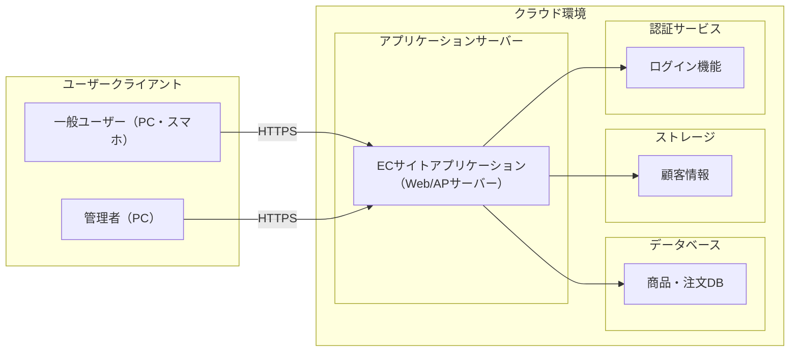
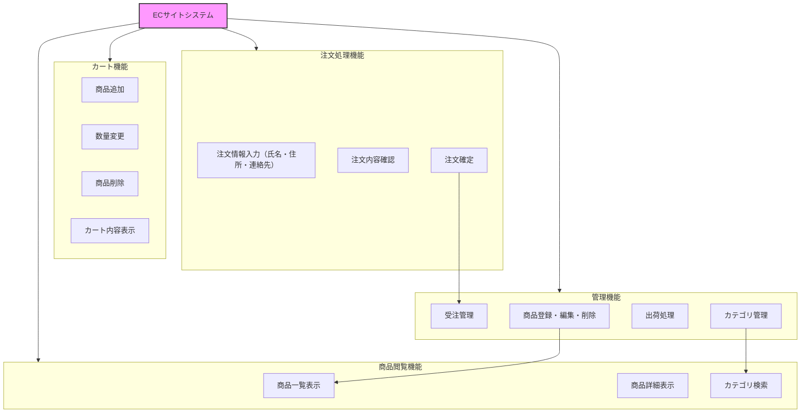
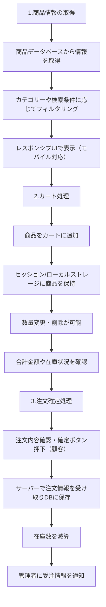
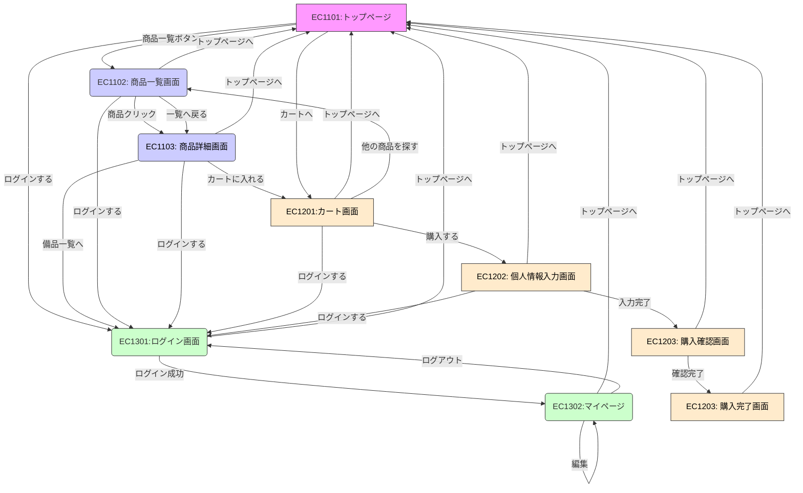
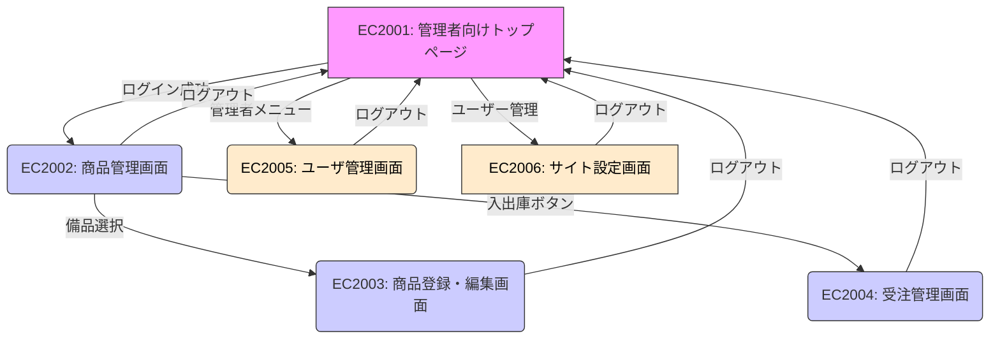
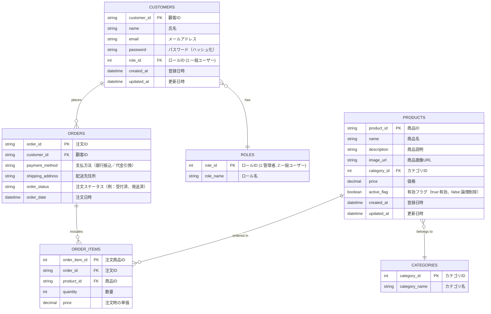
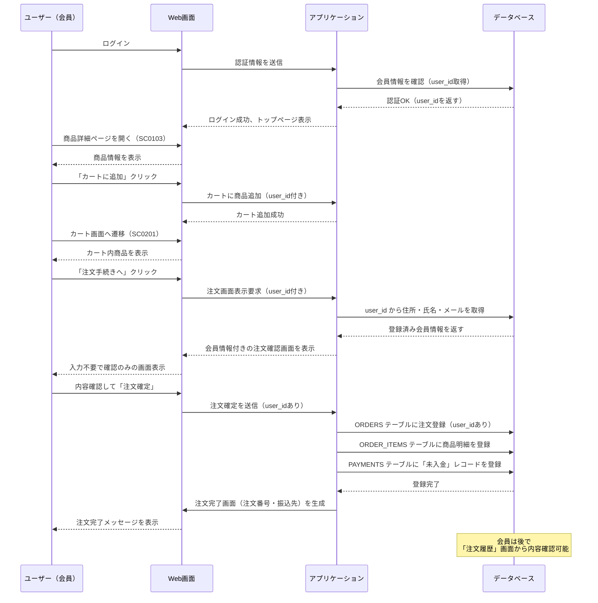
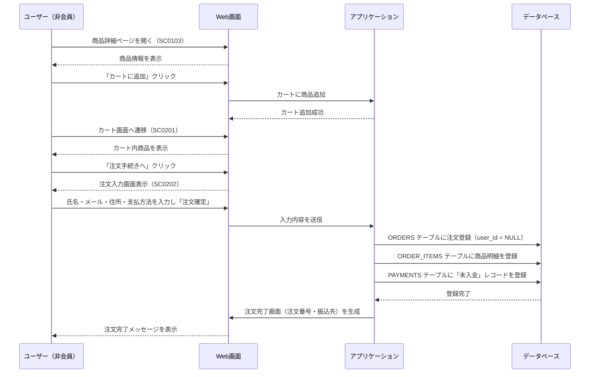

# ECサイト 基本設計書 

 

| ドキュメントバージョン | 1.0 | 

|---|---| 

| 作成日 | 2025年7月2日 | 

| 作成チーム | ECサイト開発チーム | 

| 承認者 | 株式会社〇〇 プロジェクト責任者 | 

| 更新履歴 | 2025/07/02: 初版作成 | 
 

## 1. はじめに 

### 1.1 本書の目的 

本書は、株式会社〇〇のECサイト新規構築プロジェクトにおける基本設計の内容を定義するものである。要件定義書で定められた要件に基づき、システムの全体構成、主要な機能、画面、データ、非機能要件への対応方針などを明確にし、後続の詳細設計、実装、テスト工程のインプットとすることを目的とする。 

 

### 1.2 プロジェクト概要 

より多くの顧客に商品を届けるため、新たにECサイトを構築し、販路の拡大とブランドの価値向上を目指す。本プロジェクトはその第一歩として、基本機能を備えたECサイトを短期間で立ち上げるものである。 

 

### 1.3 前提知識 
株式会社〇〇は、実店舗でデザイン性の高い雑貨（文房具、キッチン小物等）を販売しているが、販売地域が限られ、新規顧客の獲得に課題を抱えていた。また、SNSでの個別対応による受注は、工数がかかり効率が悪いという問題もある。 
 

## 2. システム概要 

### 2.1 システム目的 
- オンライン販売チャネルの新規構築により、顧客の購入利便性を高める   

- 商品の魅力が伝わる、シンプルかつ洗練されたデザインのWebサイトを提供する   

- スマートフォンからも快適に利用できるECサイトを構築する   
 

### 2.2 対象ユーザー 

- 管理者：商品登録・更新、受注管理、出荷処理、売上管理、サイト設定等を行う。主にクライアント企業の担当者が想定される。 

- 一般利用者：オンライン販売サイトを通じて商品検索・閲覧・購入を行うエンドユーザー。 

 

### 2.3 システム構成図 

システム全体のハードウェア、ソフトウェア、ネットワーク構成。 

### 2.4 外部インターフェース概要 

外部システムとの連携方式やデータの概要。 

 

## 3. 機能設計 

### 3.1 機能一覧  

### 3.2 機能構成図 

### 3.3 主要機能フロー 

特に重要な機能について、処理の流れを示した図や説明（注文処理フロー）。 

**1. 商品情報の取得**

機能: 商品一覧・詳細表示、カテゴリー別表示 

処理:
①商品データベースから情報を取得 
②カテゴリーや検索条件に応じてフィルタリング 
③モバイル対応のレスポンシブUIで表示 

**2. カート処理**

機能: カートに追加、カート内編集 

処理: 
①セッションまたはローカルストレージに商品情報を保持
②数量変更・削除などの操作を可能にする 
③合計金額や在庫状況の確認 

**3. 注文確定処理**

機能: 注文確定（決済機能なし） 

処理: 
①顧客が注文内容を確認し、確定ボタンを押す 
②サーバー側で注文情報を受け取り、DBに保存 
③在庫数を減算 
④管理者向けに受注情報を通知 

## 4. 画面設計 

### 4.1 画面一覧 
- **EC1101:トップページ** 

    - オンライン販売サイトの起点となる画面。サイトのブランドイメージを伝えるバナーを配置し、商品一覧やカート画面等に遷移しやすい構成。 

- **EC1301:ログイン画面** 

    - 既に登録済みのユーザーが、メールアドレスとパスワードを入力してログインする画面。マイページや購入手続きなど、会員専用機能にアクセスするための入り口となる。 

- **EC1302:マイページ** 

    - ログイン中のユーザーが、自身のアカウント情報を確認・管理できる画面。 

- **EC1102: 商品一覧画面** 

    - オンライン販売サイトに登録されている商品を一覧表示する画面。商品はカテゴリ別に表示され、キーワード検索やカテゴリ絞り込み、在庫数の表示、価格順価格順並び替えなどフィルター機能を配置。 

    - 商品カードには、商品画像、商品名、価格を含み、「詳細」から商品詳細画面（EC1103）への導線となる。 

- **EC1103: 商品詳細画面** 

    - 選択した商品の詳細情報を表示。価格、商品説明、在庫数、画像、レビューなどを確認可能。「カートに入れる」ボタンを設置。 

- **EC1201:カート画面** 

    - ユーザーが選んだ商品を一覧表示。数量変更や削除が可能。購入手続き（レジに進む）への導線を提供。 

- **EC1201:情報入力画面** 

    - 商品購入時に、購入者の氏名・住所・連絡先などを入力する画面。ログインしていないユーザーに対しては、会員登録せずに購入できる「ゲスト購入」として、配送・連絡に必要な個人情報を収集する。 

- **EC1202: 購入確認画面** (または備品一覧画面内に管理者用メニューを配置) 

    - 配送先情報、支払方法、注文内容の最終確認を行う画面。「購入確定」ボタンで注文を完了させる。 

- **EC1203: 購入完了画面**  

    - 注文処理完了後に表示される画面。注文番号や確認メール送信の案内を表示。トップページやマイページへのリンクを設置。 

 

- **EC2001: 管理者向けトップページ**   (管理者向け) 

    - 管理者がログインするための認証画面。メールアドレスとパスワードの入力フォームを提供。 

- **EC2002: 商品管理画面** (管理者向け) 

    - 録済み商品を一覧表示・検索・絞り込みできる画面。編集・削除ボタン付き。商品追加画面へのリンクも設置。 

- **EC2003: 商品登録・編集画面** (管理者向け) 

    - 商品情報（名前、価格、在庫数、説明、画像など）を新規登録・編集できる画面。登録済み商品の内容変更も可能。 

- **EC2004: 受注管理画面** (管理者向け) 

    - ユーザーからの注文一覧を表示し、注文の詳細確認、出荷状況の更新などを行う画面。検索・絞り込み機能も提供。 

- **EC2005: ユーザ管理画面** (管理者向け) 

    - 会員登録済みのユーザーを一覧・検索・管理するための管理者用画面。個々のユーザー情報の確認や編集、強制退会処理などを行う。 

- **EC2006: サイト設定画面** (管理者向け) 

    - ECサイト全体の設定を管理する画面。営業日、消費税率、メールテンプレート、バナー画像などの基本的なサイト運用に関わる項目を設定できる。 

- (その他、必要に応じて画面を追加) 
 

### 4.2 画面遷移図 

画面間の遷移の流れを示した図。 

 

### 4.3 UI/UX基本方針 

画面設計における基本的な考え方、デザイン原則など。 

- **シンプルさ**: ECサイトとしての主目的である商品閲覧→購入を阻害しないよう、不要な情報や要素は極力省き、直感的なナビゲーション構成とする。トップページから商品一覧/詳細/カートへの導線は明確にし、購入までをスムーズにできるよう設計。非会員でも購入可能なフローを重視。 

- **一貫性**: ボタンの配置、フォントサイズ、ラベル文言、エラーメッセージの表示形式などを全画面で共通のスタイルを使用し、システム全体で統一する。 

- **視認性**: 白を基調としたデザインで、清潔感とブランドイメージの両立を図る。フォントは可読性の高いものを使用。サイズや行間はスマートフォンでも見やすいバランスに調整。コントラスト比、文字サイズ、カラーだけで状態を表さないなどアクセシビリティに配慮。 

- **効率性と操作負担の軽減**: 商品一覧→カート→購入などよく使う操作を最小のステップで完結できるよう設計。入力フォームは自動入力や郵便番号による住所の補完など入力支援の導入。ログイン済ユーザーには情報の自動補完を行い、購入の高速化を目指す。 

- **フィードバック**: ユーザーの操作に対して、即時に視覚的・文言によるフィードバックを明確に表示。完了形の画面では、明確に結果（成功/失敗）を表示し、次のアクション（トップページへ戻る等）を提示。 

- **モバイルファースト対応**: 主な利用端末としてスマートフォンを重視し、タッチ操作と画面サイズに最適化されたレイアウト・ナビゲーションを設計。PC/スマホいずれでも破綻しない表示と操作性を確保。 

- **ブランドイメージとの整合**: デザイン性の高い雑貨を扱うブランド特性に合わせ、洗練されたミニマルなデザインを採用。商品写真の見せ方にも配慮し、商品そのものの魅力を際立たせるUIとする。カラーはモノトーン基調にアクセントカラーを最低限使用。落ち着きと信頼感を演出。 

- **将来的な拡張への配慮**: 今後追加される予定のクレジット決済機能などに備え、UIの拡張性と配置の余白設計をあらかじめ考慮。一時的に未使用な要素（レビュー、評価など）のUIコンポーネントは将来的に差し込みができるような構造で設計。 

 

### 4.4 主要画面のワイヤーフレーム（必要に応じて） 

- 商品一覧画面ワイヤーフレーム 

- 受注・出荷管理画面ワイヤーフレーム 

 

### 4.5. 主要画面項目定義（例：商品一覧画面） 

 

## 5. データ設計 

### 5.1 概念データモデル（ER図） 

### 5.2 主要テーブル概要 

CUSTOMERS（顧客テーブル） 

一般ユーザー用ECサイトの利用者情報を保持。 

会員登録が任意のため、パスワードをNULL許容する設計も検討可能。 

ロールによってゲスト／会員を分類。 

CUSTOMER_ROLES（顧客ロールマスタ） 

ゲスト、会員などの区分を管理するマスタテーブル。 

PRODUCTS（商品マスタ） 

ECサイト上で販売する商品情報を保持。 

管理画面経由で管理者が登録・更新。 

カテゴリ情報と紐付け、表示用の画像URLも保持。 

CATEGORIES（カテゴリマスタ） 

商品を分類するカテゴリ（キッチン用品、文房具など）を保持。 

カテゴリ別に商品を表示する際に使用。 

ORDERS（注文テーブル） 

顧客の注文情報を保持。 

支払い方法（銀行振込、代引き）、注文ステータスなども保持。 

ORDER_ITEMS（注文商品テーブル） 

注文ごとの購入商品を明細単位で保持。 

商品ごとの単価、数量を記録。 

ADMIN_USERS（管理者ユーザテーブル） 

管理者サイト専用のログインユーザー情報を保持。 

一般ユーザーとは完全に別テーブルで管理。 

商品登録や注文管理等を担当。 

 
 

### 5.3 データフロー概要 

- 登録済ユーザー

&nbsp;
- 非登録ユーザー

 

## 6. 非機能要件の対応方針 

- 性能：目標性能値と、それを実現するためのアーキテクチャ上の方針（負荷分散、キャッシュなど）。 

- セキュリティ：セキュリティ要件と、それに対する具体的な対策方針（認証方式、暗号化方針、アクセス制御など）。 

- 可用性：可用性目標と、それを実現するための方針（冗長構成、バックアップ方針など）。 

- その他（保守性、運用性、拡張性など） 

 

## 7. 運用・保守設計の概要 

### 7.1 ログ設計方針 

どのようなログを、どのように出力・管理するか。 

 

### 7.2 監視設計方針 

システムの稼働状況をどのように監視するか。 

 

### 7.3 バックアップ・リカバリ方針 

データのバックアップと復旧に関する方針。 

 

## 8. 制約事項・前提条件 

### 8.1 使用技術スタック 

プログラミング言語、フレームワーク、データベース、ライブラリなど、開発に使用する技術とそのバージョン。 

 

### 8.2 インフラ環境 

利用するクラウドサービスやOSなどの前提条件。 

 

### 8.3 開発・運用ルール 

コーディング規約、バージョン管理ルールなど、プロジェクト固有のルール。 

 

### 8.4 スコープ外 

今回の開発範囲に含まれない事項。 

 

### 8.5 その他前提条件 

 

## 9. 用語集・略語リスト 

- ECサイト：Electronic Commerce Siteの略。Web上で商品を販売するサイト 

- カート機能：ユーザーが購入したい商品を一時的に保管する仮想的な買い物かご機能 

- 決済機能：オンラインでのクレジットカード決済等を処理する機能 

 