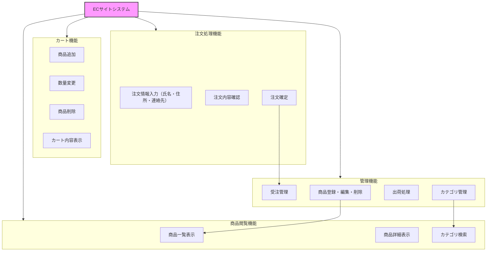
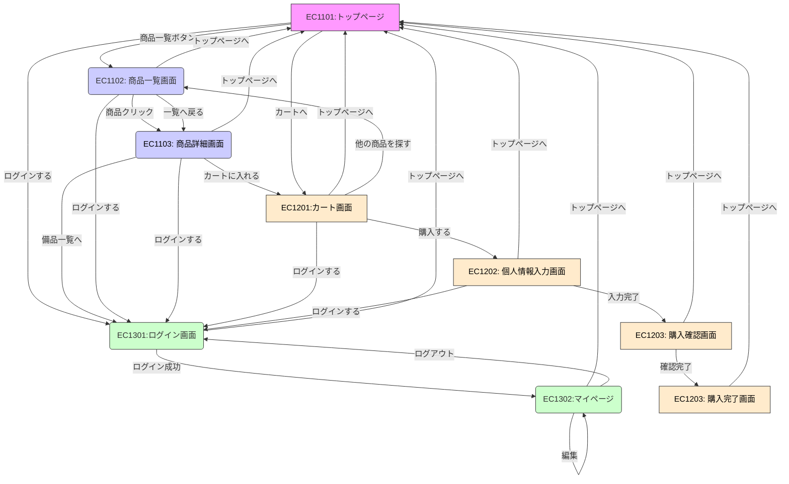
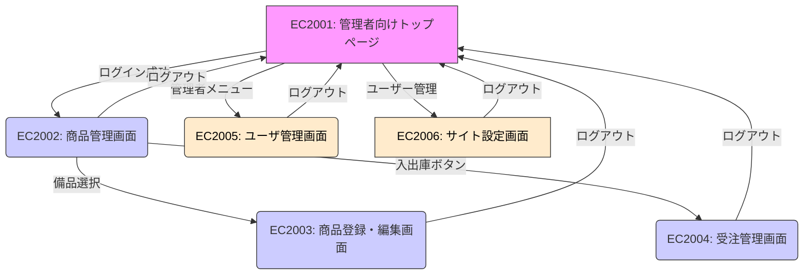
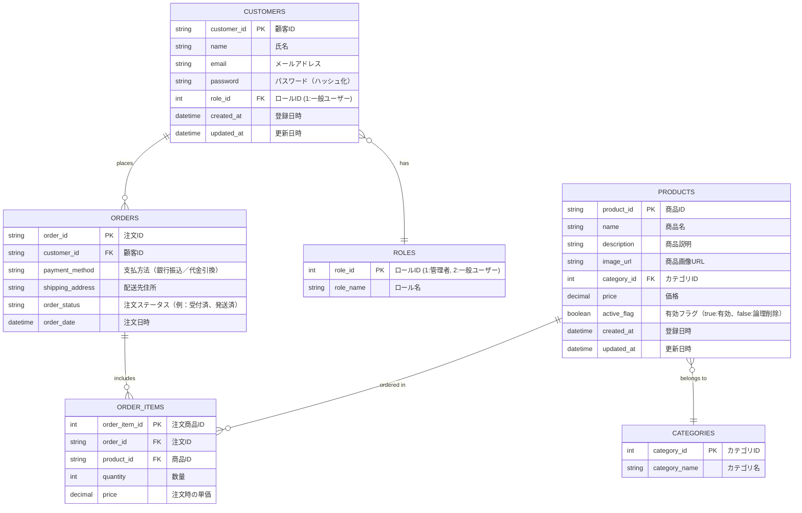
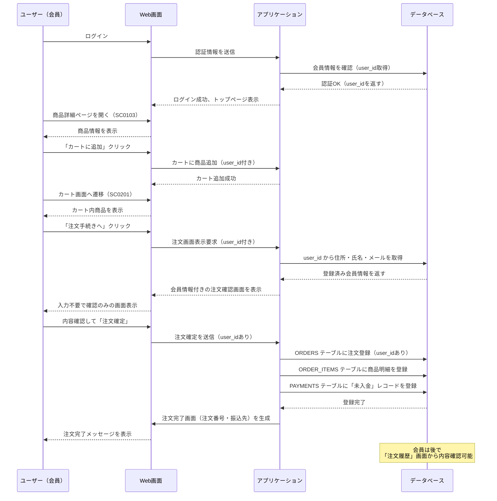
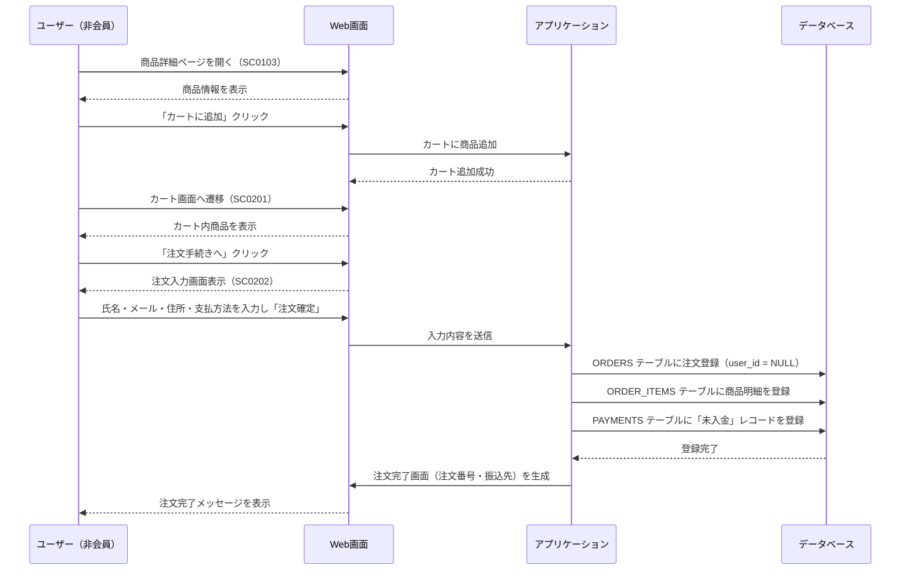

# ECサイト 基本設計書 

 

| ドキュメントバージョン | 1.0 | 

|---|---| 

| 作成日 | 2025年6月30日 | 

| 作成チーム | ECサイト開発チーム | 

| 承認者 | 株式会社〇〇 プロジェクト責任者 | 

| 更新履歴 | 2025/07/01: 初版作成 | 
 

## 1. はじめに 

### 1.1 本書の目的 

本書は、株式会社〇〇のECサイト新規構築プロジェクトにおける基本設計の内容を定義するものである。要件定義書で定められた要件に基づき、システムの全体構成、主要な機能、画面、データ、非機能要件への対応方針などを明確にし、後続の詳細設計、実装、テスト工程のインプットとすることを目的とする。 

 

### 1.2 プロジェクト概要 

より多くの顧客に商品を届けるため、新たにECサイトを構築し、販路の拡大とブランドの価値向上を目指す。本プロジェクトはその第一歩として、基本機能を備えたECサイトを短期間で立ち上げるものである。 

 

### 1.3 前提知識 

 

## 2. システム概要 

### 2.1 システム目的 

 

### 2.2 対象ユーザー 

- 管理者：商品登録・更新、受注管理、出荷処理、売上管理、サイト設定等を行う。主にクライアント企業の担当者が想定される。 

- 一般利用者：オンライン販売サイトを通じて商品検索・閲覧・購入を行うエンドユーザー。 

 

### 2.3 システム構成図 

システム全体のハードウェア、ソフトウェア、ネットワーク構成。 

 

### 2.4 外部インターフェース概要 

外部システムとの連携方式やデータの概要。 

 

## 3. 機能設計 

### 3.1 機能一覧  
- 商品閲覧機能(商品一覧表示・商品詳細表示・カテゴリ検索）
- カート機能（商品追加削除・数量変更・カート内容表示）
- 注文処理機能（注文情報入力・注文内容確認・注文確定）
- 管理機能（商品登録・編集・受注管理・出荷処理・カテゴリ管理）
### 3.2 機能構成図 

### 3.3 主要機能フロー 

特に重要な機能について、処理の流れを示した図や説明（例: 注文処理フロー）。 

 

## 4. 画面設計 

### 4.1 画面一覧 

 

### 4.2 画面遷移図 

画面間の遷移の流れを示した図。 

 

### 4.3 UI/UX基本方針 

画面設計における基本的な考え方、デザイン原則など。 

 

### 4.4 主要画面のワイヤーフレーム（必要に応じて） 

- 商品一覧画面ワイヤーフレーム 

- 受注・出荷管理画面ワイヤーフレーム 

 

### 4.5. 主要画面項目定義（例：商品一覧画面） 

 

## 5. データ設計 

### 5.1 概念データモデル（ER図） 

### 5.2 主要テーブル概要 

CUSTOMERS（顧客テーブル） 

一般ユーザー用ECサイトの利用者情報を保持。 

会員登録が任意のため、パスワードをNULL許容する設計も検討可能。 

ロールによってゲスト／会員を分類。 

CUSTOMER_ROLES（顧客ロールマスタ） 

ゲスト、会員などの区分を管理するマスタテーブル。 

PRODUCTS（商品マスタ） 

ECサイト上で販売する商品情報を保持。 

管理画面経由で管理者が登録・更新。 

カテゴリ情報と紐付け、表示用の画像URLも保持。 

CATEGORIES（カテゴリマスタ） 

商品を分類するカテゴリ（キッチン用品、文房具など）を保持。 

カテゴリ別に商品を表示する際に使用。 

ORDERS（注文テーブル） 

顧客の注文情報を保持。 

支払い方法（銀行振込、代引き）、注文ステータスなども保持。 

ORDER_ITEMS（注文商品テーブル） 

注文ごとの購入商品を明細単位で保持。 

商品ごとの単価、数量を記録。 

ADMIN_USERS（管理者ユーザテーブル） 

管理者サイト専用のログインユーザー情報を保持。 

一般ユーザーとは完全に別テーブルで管理。 

商品登録や注文管理等を担当。 

 
 

### 5.3 データフロー概要 

- 登録済ユーザー

&nbsp;
- 非登録ユーザー

 

## 6. 非機能要件の対応方針 

- 性能：目標性能値と、それを実現するためのアーキテクチャ上の方針（負荷分散、キャッシュなど）。 

- セキュリティ：セキュリティ要件と、それに対する具体的な対策方針（認証方式、暗号化方針、アクセス制御など）。 

- 可用性：可用性目標と、それを実現するための方針（冗長構成、バックアップ方針など）。 

- その他（保守性、運用性、拡張性など） 

 

## 7. 運用・保守設計の概要 

### 7.1 ログ設計方針 

どのようなログを、どのように出力・管理するか。 

 

### 7.2 監視設計方針 

システムの稼働状況をどのように監視するか。 

 

### 7.3 バックアップ・リカバリ方針 

データのバックアップと復旧に関する方針。 

 

## 8. 制約事項・前提条件 

### 8.1 使用技術スタック 

プログラミング言語、フレームワーク、データベース、ライブラリなど、開発に使用する技術とそのバージョン。 

 

### 8.2 インフラ環境 

利用するクラウドサービスやOSなどの前提条件。 

 

### 8.3 開発・運用ルール 

コーディング規約、バージョン管理ルールなど、プロジェクト固有のルール。 

 

### 8.4 スコープ外 

今回の開発範囲に含まれない事項。 

 

### 8.5 その他前提条件 

 

## 9. 用語集・略語リスト 

- ECサイト：Electronic Commerce Siteの略。Web上で商品を販売するサイト 

- カート機能：ユーザーが購入したい商品を一時的に保管する仮想的な買い物かご機能 

- 決済機能：オンラインでのクレジットカード決済等を処理する機能 

 