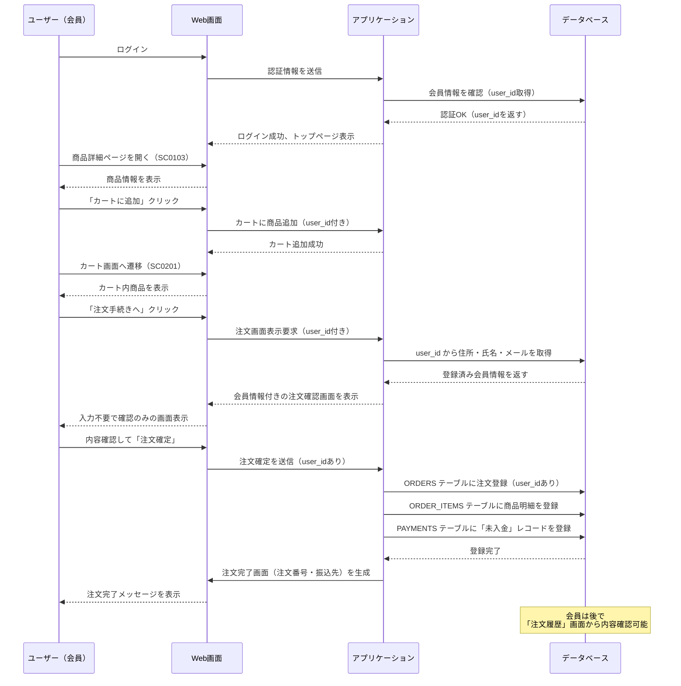
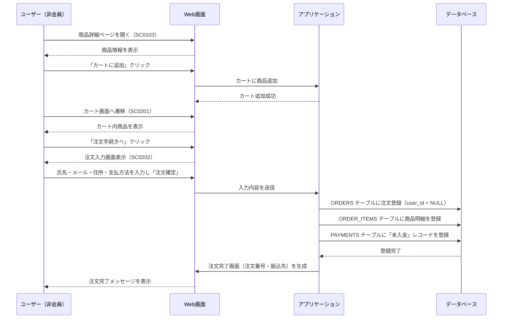

- 登録済ユーザー

```mermaid
sequenceDiagram
    participant User as ユーザー（会員）
    participant UI as Web画面
    participant Backend as アプリケーション
    participant DB as データベース

    User->>UI: ログイン
    UI->>Backend: 認証情報を送信
    Backend->>DB: 会員情報を確認（user_id取得）
    DB-->>Backend: 認証OK（user_idを返す）
    Backend-->>UI: ログイン成功、トップページ表示

    User->>UI: 商品詳細ページを開く（SC0103）
    UI-->>User: 商品情報を表示

    User->>UI: 「カートに追加」クリック
    UI->>Backend: カートに商品追加（user_id付き）
    Backend-->>UI: カート追加成功

    User->>UI: カート画面へ遷移（SC0201）
    UI-->>User: カート内商品を表示

    User->>UI: 「注文手続きへ」クリック
    UI->>Backend: 注文画面表示要求（user_id付き）

    Backend->>DB: user_id から住所・氏名・メールを取得
    DB-->>Backend: 登録済み会員情報を返す
    Backend-->>UI: 会員情報付きの注文確認画面を表示
    UI-->>User: 入力不要で確認のみの画面表示

    User->>UI: 内容確認して「注文確定」

    UI->>Backend: 注文確定を送信（user_idあり）
    Backend->>DB: ORDERS テーブルに注文登録（user_idあり）
    Backend->>DB: ORDER_ITEMS テーブルに商品明細を登録
    Backend->>DB: PAYMENTS テーブルに「未入金」レコードを登録
    DB-->>Backend: 登録完了

    Backend->>UI: 注文完了画面（注文番号・振込先）を生成
    UI-->>User: 注文完了メッセージを表示

    Note over DB: 会員は後で<br>「注文履歴」画面から内容確認可能
```

&nbsp;
- 非登録ユーザー

```mermaid
sequenceDiagram
    participant User as ユーザー（非会員）
    participant UI as Web画面
    participant Backend as アプリケーション
    participant DB as データベース

    User->>UI: 商品詳細ページを開く（SC0103）
    UI-->>User: 商品情報を表示

    User->>UI: 「カートに追加」クリック
    UI->>Backend: カートに商品追加
    Backend-->>UI: カート追加成功

    User->>UI: カート画面へ遷移（SC0201）
    UI-->>User: カート内商品を表示

    User->>UI: 「注文手続きへ」クリック
    UI-->>User: 注文入力画面表示（SC0202）

    User->>UI: 氏名・メール・住所・支払方法を入力し「注文確定」

    UI->>Backend: 入力内容を送信
    Backend->>DB: ORDERS テーブルに注文登録（user_id = NULL）
    Backend->>DB: ORDER_ITEMS テーブルに商品明細を登録
    Backend->>DB: PAYMENTS テーブルに「未入金」レコードを登録
    DB-->>Backend: 登録完了

    Backend->>UI: 注文完了画面（注文番号・振込先）を生成
    UI-->>User: 注文完了メッセージを表示
```