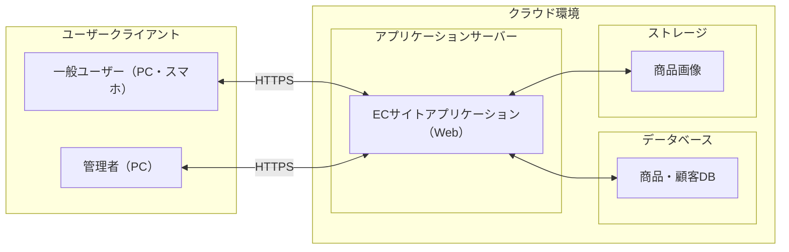
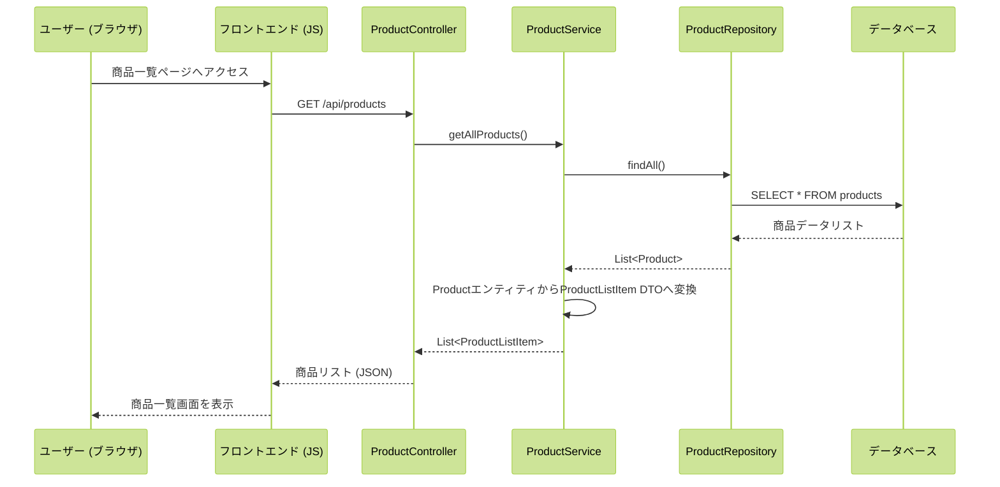
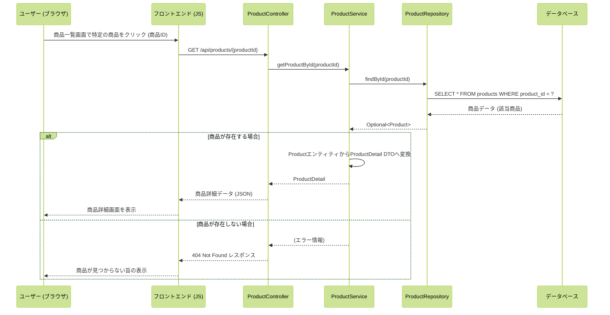
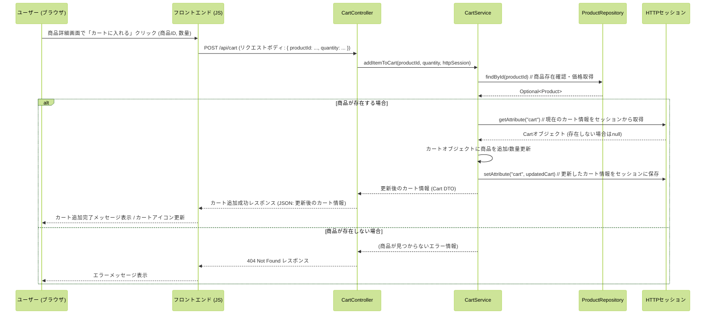
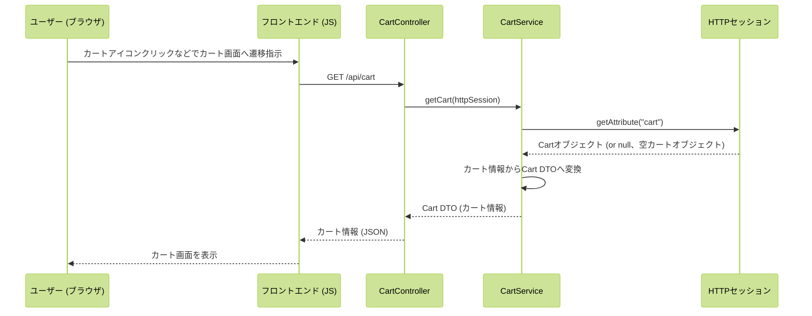
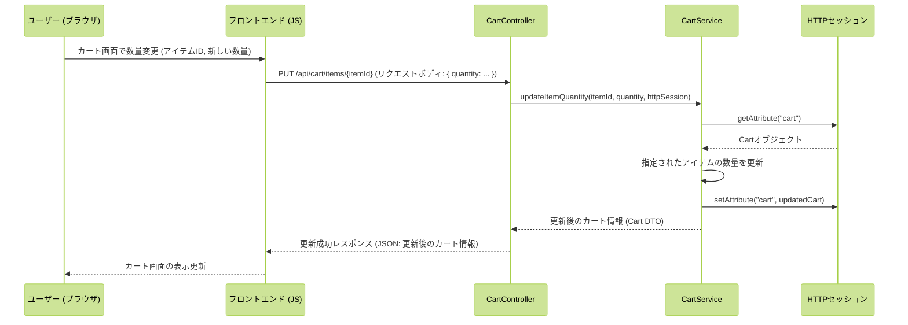
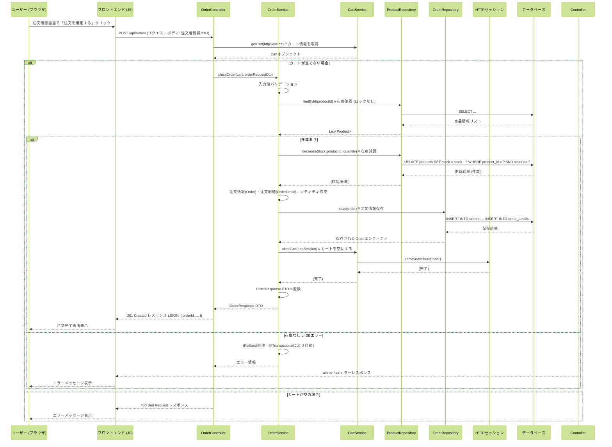
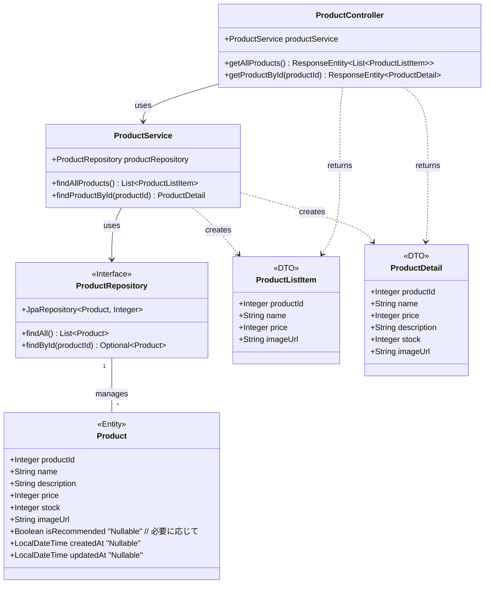
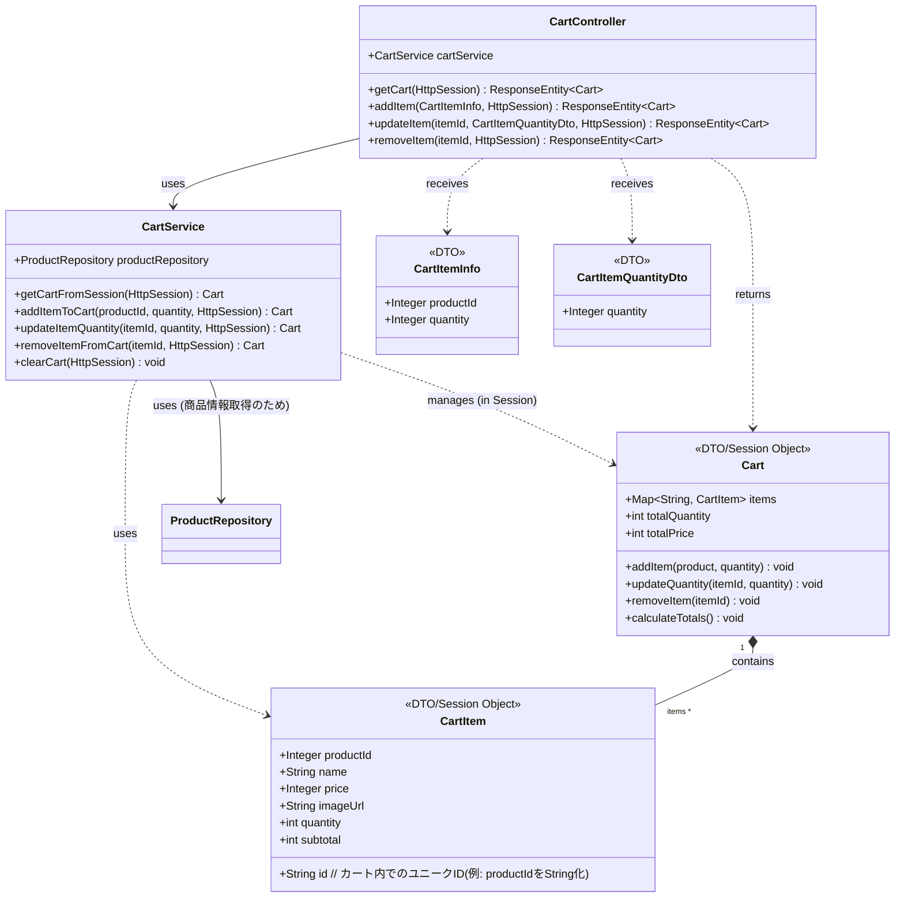

# ECサイト　詳細設計書

| ドキュメントバージョン | 1.0                                   |
| :------------------- | :------------------------------------ |
| 作成日               | 2025年4月6日                          |
| 作成チーム           | チーム〇〇                            |
| 更新履歴             | 2025/04/06: Ver.1.0 初版作成 (チーム〇〇) |

## 1. はじめに

### 1.1. 本書の目的

本書は、ECサイト新規構築プロジェクトにおける詳細設計の内容を定義するものです。基本設計書 Ver.1.0 で定義された内容に基づき、実装担当者がプログラミング作業を迷いなく進められるように、システムの内部構造、処理フロー、インターフェース、データベース構造、画面項目などを具体的に記述します。

### 1.2. 前提となる基本設計書

本書は、以下の基本設計書の内容を前提としています。

- ECサイト 基本設計書 Ver.1.0

### 1.3. 対象読者

本書は、以下の担当者を対象としています。

- 本システムのバックエンド開発担当者
- 本システムのフロントエンド開発担当者
- 本システムのテスト担当者
- プロジェクト管理者

### 1.4. 参考文献

- ECサイト 基本設計書 Ver.1.0

## 2. システム概要

システムの目的、対象ユーザー、全体構成については、基本設計書 Ver.1.0 の「2. システム概要」に記載の通りです。

**システム構成（再掲）**



## 3. 機能仕様

### 3.1. 機能一覧

本システムが提供する必須機能は以下の通りです。（基本設計書のF001～F008に相当）

| 機能ID | 機能名         | 概要                         | MoSCoW | 備考             |
| ---- | ----------- | -------------------------- | ------ | -------------- |
| F001 | 商品一覧表示機能    | 商品をカテゴリ別に一覧表示。検索・絞り込み機能を含む | Must   | UI/UX・操作性にも関係  |
| F002 | 商品詳細表示機能    | 写真、価格、説明、素材など詳細情報を表示       | Must   | 商品情報の訴求力強化     |
| F003 | カート機能       | 複数商品をカートに入れてまとめて購入可能       | Must   | 非会員でも利用可       |
| F004 | 購入機能        | 注文確定までのフロー。決済は除く           | Must   | 在庫管理や管理者処理と連動  |
| F005 | 管理画面機能      | 商品登録・更新、受注管理などを行う管理者用画面    | Should | クライアント企業が利用    |
| F006 | カテゴリー別表示    | 商品をカテゴリー単位で分類・表示           | Should | 商品一覧機能と連動      |
| F007 | 会員登録／ログイン機能 | ユーザーが住所や履歴を保存可能。任意登録       | Could  | 将来的に購入履歴機能と連携  

### 3.2. 機能詳細

主要機能における、ユーザー操作から始まるフロントエンドとバックエンドAPI間の連携、およびバックエンド内部のクラス間連携の概要をシーケンス図で示します。

#### 3.2.1. 商品一覧表示機能 (F001)
 
ユーザーが商品一覧ページにアクセスした際の処理フローです。
 

 
#### 3.2.2. 商品詳細表示機能 (F002)
 
ユーザーが商品一覧から特定の商品を選択し、詳細ページを表示する際の処理フローです。
 

 
#### 3.2.3. カート追加・表示・編集機能 (F003)
 
ユーザーが商品詳細ページで「カートに入れる」ボタンを押した際の処理フローです。カート情報はHTTPセッションで管理します。
 
**カート追加 (POST /api/cart)**
 

 
ユーザーがカートの中身を確認、数量変更、削除する際の処理フローです。
 
**カート情報取得 (GET /api/cart)**
 

 
**カート数量変更 (PUT /api/cart/items/{itemId})**
 

 
**カート商品削除 (DELETE /api/cart/items/{itemId})** (上記PUTと同様の流れ)
 
#### 3.2.4. 購入処理 (F004)
 
ユーザーが注文確認画面で「注文を確定する」ボタンを押した際の処理フローです。（非会員注文）
 


---

## 4. クラス設計

ここでは、「シンプル雑貨オンライン」バックエンド（Spring Boot）アプリケーションのクラス構造について定義します。主要なパッケージ構成、クラス図、主要クラスの説明、およびデータ転送オブジェクト（DTO）の定義を示します。

### 4.1. 主要パッケージ構成

ソースコードの整理と見通しを良くするため、以下のようなパッケージ構成を基本とします。ルートパッケージは `com.example.simplezakka` （仮）とします。

```
com.example.simplezakka
├── SimpleZakkaOnlineApplication.java  // Spring Boot起動クラス
│
├── controller      // HTTPリクエスト処理、APIエンドポイント定義
│   ├── ProductController.java
│   ├── CartController.java
│   └── OrderController.java
│
├── service         // ビジネスロジック実装
│   ├── ProductService.java
│   ├── CartService.java     // カート(セッション)操作ロジック
│   └── OrderService.java
│
├── repository      // データベースアクセス (Spring Data JPA)
│   ├── ProductRepository.java
│   ├── OrderRepository.java
│   └── OrderDetailRepository.java
│
├── entity          // DBテーブルに対応するJPAエンティティ
│   ├── Product.java
│   ├── Order.java
│   └── OrderDetail.java
│
├── dto             // Data Transfer Object (API入出力、レイヤー間データ転送用)
│   ├── product
│   │   ├── ProductListItem.java
│   │   └── ProductDetail.java
│   ├── cart
│   │   ├── Cart.java         // カート全体を表すDTO (セッション格納用でもある)
│   │   └── CartItem.java     // カート内商品を表すDTO
│   │   ├── CartItemInfo.java
│   │   └── CartItemQuantityDto.java
│   └── order
│       ├── OrderRequest.java
│       ├── CustomerInfo.java // OrderRequest内で使用 (非会員用)
│       └── OrderResponse.java
│
├── exception       // 例外ハンドリング
│   └── GlobalExceptionHandler.java // 基本的な例外ハンドリング
│
└── config
    └── DataLoader.java // サンプルデータロード用
```


### 4.2. クラス図

主要な機能ドメイン（商品、カート、注文）に関するクラスとその関連を示します。

#### 4.2.1. 商品関連クラス図



#### 4.2.2. カート関連クラス図 (セッション管理)



#### 4.2.3. 注文関連クラス図 (非会員注文)


### 4.3. 主要クラス説明

各レイヤーのクラスの役割と、シンプル雑貨オンラインにおける代表的なクラス名は以下の通りです。

- **Controller (`@RestController`)**: フロントエンドからのHTTPリクエストを受け付け、Serviceを呼び出し、結果をJSON形式で返す責務を持ちます。URLルーティング、リクエストデータの受け取りと基本的なバリデーション、レスポンスの生成を担当します。
    - 例: `ProductController`, `CartController`, `OrderController`
- **Service (`@Service`)**: アプリケーションのビジネスロジックを実装する責務を持ちます。Controllerから依頼を受け、必要に応じて複数のRepositoryを操作し、結果をControllerに返します。基本的なトランザクション管理も主にこの層で行います。
    - 例: `ProductService`, `CartService`, `OrderService`
- **Repository (`@Repository`)**: データベースへのアクセス（基本的なCRUD操作）を担当するインターフェースです。Spring Data JPAを利用し、`JpaRepository`を継承することで基本的なDB操作メソッドが提供されます。複雑なクエリの利用は最小限に留めます。
    - 例: `ProductRepository`, `OrderRepository`, `OrderDetailRepository`
- **Entity (`@Entity`)**: データベースのテーブル構造にマッピングされるJavaオブジェクトです。テーブルのカラムに対応するフィールドを持ち、JPAのアノテーションが付与されます。
    - 例: `Product`, `Order`, `OrderDetail`
- **DTO (Data Transfer Object)**: レイヤー間（特にControllerとService、APIの境界）でデータを転送するためのオブジェクトです。APIのリクエスト/レスポンス形式の定義にも使用されます。
    - 例: `ProductListItem`, `ProductDetail`, `Cart`, `OrderRequest`, `OrderResponse`

### 4.4. DTO定義

主要なAPIや機能で使用されるDTOの構造を示します。 (バリデーションルールは簡略化)

**商品関連 DTO**

```java
// 商品一覧用
public class ProductListItem {
    private Integer productId;
    private String name;
    private Integer price;
    private String imageUrl;
    // getters, constructor
}

// 商品詳細用
public class ProductDetail {
    private Integer productId;
    private String name;
    private Integer price;
    private String description;
    private Integer stock;
    private String imageUrl;
    // getters, constructor
}
```

**カート関連 DTO**

```java
// カート全体 (セッション格納/APIレスポンス用)
public class Cart {
    private Map<String, CartItem> items = new LinkedHashMap<>();
    private int totalQuantity;
    private int totalPrice;
    // メソッド: addItem, updateQuantity, removeItem, calculateTotals など
    // getters
}

// カート内商品 (セッション格納/APIレスポンス用)
public class CartItem {
    private String id;
    private Integer productId;
    private String name;
    private Integer price;
    private String imageUrl;
    private int quantity;
    private int subtotal;
    // getters, setters, constructor
}

// カート追加APIリクエスト用
public class CartItemInfo {
    @NotNull
    private Integer productId;
    @NotNull @Min(1)
    private Integer quantity;
    // getters, setters
}

// カート数量更新APIリクエスト用
public class CartItemQuantityDto {
    @NotNull @Min(1)
    private Integer quantity;
    // getters, setters
}
```

**注文関連 DTO**

```java
// 注文APIリクエスト用
public class OrderRequest {
    @Valid // ネストしたDTOのバリデーションを有効化
    @NotNull
    private CustomerInfo customerInfo;
    // getters, setters
}

// 注文APIリクエスト内の顧客情報用 (非会員用)
public class CustomerInfo {
    @NotBlank
    private String name;
    @NotBlank @Email
    private String email;
    @NotBlank
    private String address;
    @NotBlank
    private String phoneNumber;
    // getters, setters
}

// 注文APIレスポンス用
public class OrderResponse {
    private Integer orderId;
    private LocalDateTime orderDate;
    // getters, constructor
}
```

---
## 5. インターフェース仕様

### 5.1 REST API一覧

| No | エンドポイント                     | メソッド | 機能概要                     | 対応機能ID |
|----|----------------------------------|--------|----------------------------|------------|
| 1  | `/api/products`                 | GET    | 商品一覧を取得（カテゴリ・検索対応） | F001       |
| 2  | `/api/products/{productId}`     | GET    | 商品詳細情報を取得            | F002       |
| 3  | `/api/cart`                     | GET    | カートの内容を取得             | F003       |
| 4  | `/api/cart`                     | POST   | 商品をカートに追加             | F003       |
| 5  | `/api/cart/items/{itemId}`     | PUT    | カート内商品の数量変更          | F003       |
| 6  | `/api/cart/items/{itemId}`     | DELETE | カート内商品の削除             | F003       |
| 7  | `/api/orders`                  | POST   | 注文確定（注文情報の登録）       | F004       |

---

### 5.2 REST API詳細

#### 5.2.1 商品一覧取得API

- **エンドポイント**：`GET /api/products`
- **概要**：商品情報の一覧を取得（カテゴリ・検索キーワード対応）
- **リクエストパラメータ**（クエリ）：

| パラメータ名      | 型     | 必須 | 説明                          |
|------------------|--------|------|-----------------------------|
| keyword          | string | 任意 | 商品名または説明の部分一致検索        |
| categoryId       | int    | 任意 | カテゴリIDでの絞り込み             |
| sort             | string | 任意 | 並び順（`new`, `price_asc`, `price_desc`, `popular`） |

- **レスポンスコード**：
  - `200 OK`：商品リストを正常取得

- **レスポンス（JSON）**：`List<ProductListItem>`

```json
[
  {
    "productId": 101,
    "name": "北欧マグカップ",
    "price": 1800,
    "imageUrl": "/images/mug001.jpg"
  }
]
```

#### 5.2.2 商品詳細取得API

- **エンドポイント**：`GET /api/products/{productId}`  
- **概要**：指定された商品IDに対応する商品の詳細情報を取得  

- **パスパラメータ**：

| パラメータ名 | 型   | 必須 | 説明            |
|--------------|------|------|-----------------|
| productId    | int  | 必須 | 対象商品のID     |

- **レスポンスコード**：
  - `200 OK`：商品詳細情報を正常取得  
  - `404 Not Found`：該当商品なし  

- **レスポンス（JSON）**：`ProductDetail`

```json
{
  "productId": 101,
  "name": "北欧マグカップ",
  "price": 1800,
  "description": "陶器製のかわいいマグカップ",
  "stock": 20,
  "imageUrl": "/images/mug001.jpg"
}
```

#### 5.2.3 カート取得API

- **エンドポイント**：`GET /api/cart`  
- **概要**：セッションに保存されたカート情報を取得  

- **レスポンスコード**：
  - `200 OK`：正常取得  

- **レスポンス（JSON）**：`Cart`

```json
{
  "items": {
    "101": {
      "id": "101",
      "productId": 101,
      "name": "北欧マグカップ",
      "price": 1800,
      "imageUrl": "/images/mug001.jpg",
      "quantity": 2,
      "subtotal": 3600
    }
  },
  "totalQuantity": 2,
  "totalPrice": 3600
}
```

#### 5.2.4 カート追加API

- **エンドポイント**：`POST /api/cart`  
- **概要**：指定された商品をカートに追加  

- **リクエストボディ**：`CartItemInfo`

```json
{
  "productId": 101,
  "quantity": 2
}
```

- **レスポンスコード**：

  - `200 OK`：追加成功

  - `404 Not Found`：商品が存在しない

- **レスポンス（JSON）**：更新後の `Cart`

#### 5.2.5 カート数量変更API

- **エンドポイント**：`PUT/api/cart/items/{itemId}`

- **パスパラメータ**：

|パラメータ名|型	|必須	|説明|
|----------|--------|------|--------|
|itemId	|str	|必須	|カート内商品ID（文字列）|

- **リクエストボディ**：`CartItemQuantityDto`

```json
{
  "quantity": 3
}
```

- **レスポンスコード**：

  - `200 OK`：更新成功

  - `400 Bad Request`：不正な数量

  - `404 Not Found`：該当商品なし

- **レスポンス（JSON）**：更新後の Cart

#### 5.2.6 カート商品削除API

- **エンドポイント**：`DELETE /api/cart/items/{itemId}`

- **パスパラメータ**：

|パラメータ名|	型	|必須|	説明|
|----------|--------|------|--------|
|itemId|str	|必須|	カート内商品ID（文字列）|

- **レスポンスコード**：

  - `200 OK`：削除成功

  - `404 Not Found`：該当商品なし

- **レスポンス（JSON）**：更新後の Cart

#### 5.2.7 注文確定API

- **エンドポイント**：`POST /api/orders`

- **概要**：カートに入った商品で注文を確定（ゲスト・会員共通）

- **リクエストボディ**：`OrderRequest`

```json
{
  "customerInfo": {
    "name": "山田太郎",
    "email": "taro@example.com",
    "address": "東京都港区...",
    "phoneNumber": "09012345678"
  }
}
```

- **レスポンスコード**：

  - `201 Created`：注文成功

  - `400 Bad Request`：バリデーションエラー／カート空

  - `409 Conflict`：在庫不足

  - `500 Internal Server Error`：DBエラー等

- **レスポンス（JSON）**：`OrderResponse`

```json
{
  "orderId": 202507040001,
  "orderDate": "2025-07-04T13:00:00"
}
```

- **エラーレスポンス例**：

```json
{
  "status": 409,
  "message": "在庫が不足しています。"
}
```

## 6. DB定義

### 6.1 テーブル定義書
システムで使用するすべてのテーブルについて、以下の情報を定義します。
- カラム名
- データ型
- 制約（NOT NULL、主キー、外部キー など）

### 6.2 ER図
物理モデルのER図を掲載します（基本設計からの変更があれば反映）。

### 6.3 インデックス一覧
作成するインデックスと対象カラムを一覧で示します。

### 6.4 トランザクション設計方針
各処理におけるトランザクション境界の設定方針などを記述します。

---

## 7. 画面項目定義

### 7.1 画面一覧
基本設計からの変更点や詳細化内容があれば記述します。

### 7.2 画面項目定義書
各画面における以下の内容を定義します。
- 表示・入力項目
- UI部品（テキストボックス、プルダウン、ボタン等）
- バリデーションルール
- エラーメッセージ

### 7.3 共通エラーメッセージ一覧
システム全体で使用される共通エラーメッセージを必要に応じて定義します。

---

## 8. 非機能要件詳細

基本設計で定めた非機能要件をもとに、より具体的に記述します。
- セキュリティ対策の実装方法（例：SQLインジェクション対策、認証/認可方式など）
- 性能目標値とその達成のためのアーキテクチャや技術的工夫

---

## 9. その他

必要に応じて以下の内容を記述します。
- エラーコード体系
- ログ出力の詳細ルール
- バッチ処理の仕様
