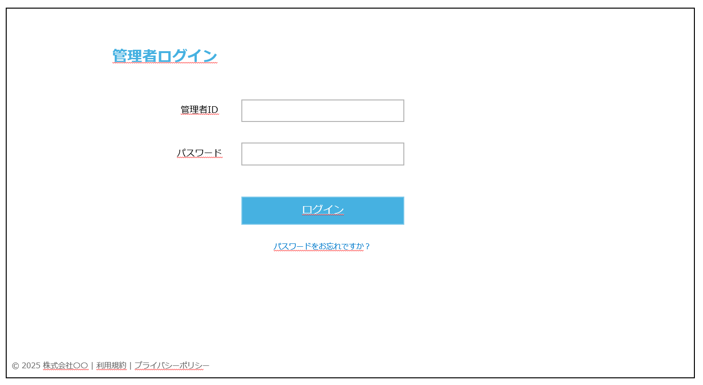

# ECサイト　詳細設計書

| ドキュメントバージョン | 1.1 |  
|---|---|
| 作成日 | 2025年7月4日 | 
| 作成チーム | Popcorn | 
| 承認者 | 株式会社〇〇 〇〇様 | 
| 更新履歴 | 2025/07/04 : 初版作成 : Popcorn | 
| 更新履歴 | 2025/07/07 : 細部の修正 : Popcorn | 

## 1. はじめに

### 1.1. 本書の目的

本書は、ECサイト新規構築プロジェクトにおける詳細設計の内容を定義するものです。基本設計書 Ver.1.3 で定義された内容に基づき、実装担当者がプログラミング作業を迷いなく進められるように、システムの内部構造、処理フロー、インターフェース、データベース構造、画面項目などを具体的に記述します。

### 1.2. 前提となる基本設計書

本書は、以下の基本設計書の内容を前提としています。

- ECサイト 基本設計書 Ver.1.3

### 1.3. 対象読者

本書は、以下の担当者を対象としています。

- 本システムのバックエンド開発担当者
- 本システムのフロントエンド開発担当者
- 本システムのテスト担当者
- プロジェクト管理者

### 1.4. 参考文献

- ECサイト 基本設計書 Ver.1.3

## 2. システム概要

システムの目的、対象ユーザー、全体構成については、基本設計書 Ver.1.3 の「2. システム概要」に記載の通りです。

**システム構成（再掲）**


## 3. 機能仕様

### 3.1. 機能一覧

本システムが提供する必須機能は以下の通りです。（基本設計書のF001～F007に相当）

| 機能ID | 機能名         | 概要                         | MoSCoW | 備考             |
| ---- | ----------- | -------------------------- | ------ | -------------- |
| F001 | 商品一覧表示機能    | 商品をカテゴリ別に一覧表示。検索・絞り込み機能を含む | Must   | UI/UX・操作性にも関係  |
| F002 | 商品詳細表示機能    | 写真、価格、説明、素材など詳細情報を表示       | Must   | 商品情報の訴求力強化     |
| F003 | カート機能       | 複数商品をカートに入れてまとめて購入可能       | Must   | 非会員でも利用可       |
| F004 | 購入機能        | 注文確定までのフロー。決済は除く           | Must   | 在庫管理や管理者処理と連動  |
| F005 | 管理画面機能      | 商品登録・更新、受注管理などを行う管理者用画面    | Should | クライアント企業が利用    |
| F006 | カテゴリー別表示    | 商品をカテゴリー単位で分類・表示           | Should | 商品一覧機能と連動      |
| F007 | 会員登録／ログイン機能 | ユーザーが住所や履歴を保存可能。任意登録       | Could  | 将来的に購入履歴機能と連携  

### 3.2. 機能詳細

主要機能における、ユーザー操作から始まるフロントエンドとバックエンドAPI間の連携、およびバックエンド内部のクラス間連携の概要をシーケンス図で示します。

#### 3.2.1. 商品一覧表示機能 (F001)
 
ユーザーが商品一覧ページにアクセスした際の処理フローです。
 

 
#### 3.2.2. 商品詳細表示機能 (F002)
 
ユーザーが商品一覧から特定の商品を選択し、詳細ページを表示する際の処理フローです。
 

 
#### 3.2.3. カート機能 (F003)
 
ユーザーが商品詳細ページで「カートに入れる」ボタンを押した際の処理フローです。カート情報はHTTPセッションで管理します。
 
**カート追加 (POST /api/cart)**
 

 
ユーザーがカートの中身を確認、数量変更、削除する際の処理フローです。
 
**カート情報取得 (GET /api/cart)**
 

 
**カート数量変更 (PUT /api/cart/items/{itemId})**
 

 
**カート商品削除 (DELETE /api/cart/items/{itemId})** (上記PUTと同様の流れ)
 
#### 3.2.4. 購入処理 (F004)
 
ユーザーが注文確認画面で「注文を確定する」ボタンを押した際の処理フローです。（非会員注文）
 


---

## 4. クラス設計

ここでは、バックエンド（Spring Boot）アプリケーションのクラス構造について定義します。主要なパッケージ構成、クラス図、主要クラスの説明、およびデータ転送オブジェクト（DTO）の定義を示します。

### 4.1. 主要パッケージ構成

ソースコードの整理と見通しを良くするため、以下のようなパッケージ構成を基本とします。ルートパッケージは `com.example.simplezakka` （仮）とします。

```
com.example.simplezakka
├── SimpleZakkaOnlineApplication.java  // Spring Boot起動クラス
│
├── controller      // HTTPリクエスト処理、APIエンドポイント定義
│   ├── ProductController.java
│   ├── CartController.java
│   └── OrderController.java
│
├── service         // ビジネスロジック実装
│   ├── ProductService.java
│   ├── CartService.java     // カート(セッション)操作ロジック
│   └── OrderService.java
│
├── repository      // データベースアクセス (Spring Data JPA)
│   ├── ProductRepository.java
│   ├── OrderRepository.java
│   └── OrderDetailRepository.java
│
├── entity          // DBテーブルに対応するJPAエンティティ
│   ├── Product.java
│   ├── Order.java
│   └── OrderDetail.java
│
├── dto             // Data Transfer Object (API入出力、レイヤー間データ転送用)
│   ├── product
│   │   ├── ProductListItem.java
│   │   └── ProductDetail.java
│   ├── cart
│   │   ├── Cart.java         // カート全体を表すDTO (セッション格納用でもある)
│   │   └── CartItem.java     // カート内商品を表すDTO
│   │   ├── CartItemInfo.java
│   │   └── CartItemQuantityDto.java
│   └── order
│       ├── OrderRequest.java
│       ├── CustomerInfo.java // OrderRequest内で使用 (非会員用)
│       └── OrderResponse.java
│
├── exception       // 例外ハンドリング
│   └── GlobalExceptionHandler.java // 基本的な例外ハンドリング
│
└── config
    └── DataLoader.java // サンプルデータロード用
```


### 4.2. クラス図

主要な機能ドメイン（商品、カート、注文）に関するクラスとその関連を示します。

#### 4.2.1. 商品関連クラス図


#### 4.2.2. カート関連クラス図 (セッション管理)


#### 4.2.3. 注文関連クラス図 (非会員注文)


### 4.3. 主要クラス説明

各レイヤーのクラスの役割と、シンプル雑貨オンラインにおける代表的なクラス名は以下の通りです。

- **Controller (`@RestController`)**: フロントエンドからのHTTPリクエストを受け付け、Serviceを呼び出し、結果をJSON形式で返す責務を持ちます。URLルーティング、リクエストデータの受け取りと基本的なバリデーション、レスポンスの生成を担当します。
    - 例: `ProductController`, `CartController`, `OrderController`
- **Service (`@Service`)**: アプリケーションのビジネスロジックを実装する責務を持ちます。Controllerから依頼を受け、必要に応じて複数のRepositoryを操作し、結果をControllerに返します。基本的なトランザクション管理も主にこの層で行います。
    - 例: `ProductService`, `CartService`, `OrderService`
- **Repository (`@Repository`)**: データベースへのアクセス（基本的なCRUD操作）を担当するインターフェースです。Spring Data JPAを利用し、`JpaRepository`を継承することで基本的なDB操作メソッドが提供されます。複雑なクエリの利用は最小限に留めます。
    - 例: `ProductRepository`, `OrderRepository`, `OrderDetailRepository`
- **Entity (`@Entity`)**: データベースのテーブル構造にマッピングされるJavaオブジェクトです。テーブルのカラムに対応するフィールドを持ち、JPAのアノテーションが付与されます。
    - 例: `Product`, `Order`, `OrderDetail`
- **DTO (Data Transfer Object)**: レイヤー間（特にControllerとService、APIの境界）でデータを転送するためのオブジェクトです。APIのリクエスト/レスポンス形式の定義にも使用されます。
    - 例: `ProductListItem`, `ProductDetail`, `Cart`, `OrderRequest`, `OrderResponse`

### 4.4. DTO定義

主要なAPIや機能で使用されるDTOの構造を示します。 (バリデーションルールは簡略化)

**商品関連 DTO**

```java
// 商品一覧用
public class ProductListItem {
    private Integer productId;
    private String name;
    private Integer price;
    private String imageUrl;
    // getters, constructor
}

// 商品詳細用
public class ProductDetail {
    private Integer productId;
    private String name;
    private Integer price;
    private String description;
    private Integer stock;
    private String imageUrl;
    // getters, constructor
}
```

**カート関連 DTO**

```java
// カート全体 (セッション格納/APIレスポンス用)
public class Cart {
    private Map<String, CartItem> items = new LinkedHashMap<>();
    private int totalQuantity;
    private int totalPrice;
    // メソッド: addItem, updateQuantity, removeItem, calculateTotals など
    // getters
}

// カート内商品 (セッション格納/APIレスポンス用)
public class CartItem {
    private String id;
    private Integer productId;
    private String name;
    private Integer price;
    private String imageUrl;
    private int quantity;
    private int subtotal;
    // getters, setters, constructor
}

// カート追加APIリクエスト用
public class CartItemInfo {
    @NotNull
    private Integer productId;
    @NotNull @Min(1)
    private Integer quantity;
    // getters, setters
}

// カート数量更新APIリクエスト用
public class CartItemQuantityDto {
    @NotNull @Min(1)
    private Integer quantity;
    // getters, setters
}
```

**注文関連 DTO**

```java
// 注文APIリクエスト用
public class OrderRequest {
    @Valid // ネストしたDTOのバリデーションを有効化
    @NotNull
    private CustomerInfo customerInfo;
    // getters, setters
}

// 注文APIリクエスト内の顧客情報用 (非会員用)
public class CustomerInfo {
    @NotBlank
    private String name;
    @NotBlank @Email
    private String email;
    @NotBlank
    private String address;
    @NotBlank
    private String phoneNumber;
    // getters, setters
}

// 注文APIレスポンス用
public class OrderResponse {
    private Integer orderId;
    private LocalDateTime orderDate;
    // getters, constructor
}
```

---
## 5. インターフェース仕様

### 5.1 REST API一覧

| No | エンドポイント                     | メソッド | 機能概要                     | 対応機能ID |
|----|----------------------------------|--------|----------------------------|------------|
| 1  | `/api/products`                 | GET    | 商品一覧を取得（カテゴリ・検索対応） | F001       |
| 2  | `/api/products/{productId}`     | GET    | 商品詳細情報を取得            | F002       |
| 3  | `/api/cart`                     | GET    | カートの内容を取得             | F003       |
| 4  | `/api/cart`                     | POST   | 商品をカートに追加             | F003       |
| 5  | `/api/cart/items/{itemId}`     | PUT    | カート内商品の数量変更          | F003       |
| 6  | `/api/cart/items/{itemId}`     | DELETE | カート内商品の削除             | F003       |
| 7  | `/api/orders`                  | POST   | 注文確定（注文情報の登録）       | F004       |

---

### 5.2 REST API詳細

#### 5.2.1 商品一覧取得API

- **エンドポイント**：`GET /api/products`
- **概要**：商品情報の一覧を取得（カテゴリ・検索キーワード対応）
- **リクエストパラメータ**（クエリ）：

| パラメータ名      | 型     | 必須 | 説明                          |
|------------------|--------|------|-----------------------------|
| keyword          | string | 任意 | 商品名または説明の部分一致検索        |
| categoryId       | int    | 任意 | カテゴリIDでの絞り込み             |
| sort             | string | 任意 | 並び順（`new`, `price_asc`, `price_desc`, `popular`） |

- **レスポンスコード**：
  - `200 OK`：商品リストを正常取得

- **レスポンス（JSON）**：`List<ProductListItem>`

```json
[
  {
    "productId": 101,
    "name": "北欧マグカップ",
    "price": 1800,
    "imageUrl": "/images/mug001.jpg"
  }
]
```

#### 5.2.2 商品詳細取得API

- **エンドポイント**：`GET /api/products/{productId}`  
- **概要**：指定された商品IDに対応する商品の詳細情報を取得  

- **パスパラメータ**：

| パラメータ名 | 型   | 必須 | 説明            |
|--------------|------|------|-----------------|
| productId    | int  | 必須 | 対象商品のID     |

- **レスポンスコード**：
  - `200 OK`：商品詳細情報を正常取得  
  - `404 Not Found`：該当商品なし  

- **レスポンス（JSON）**：`ProductDetail`

```json
{
  "productId": 101,
  "name": "北欧マグカップ",
  "price": 1800,
  "description": "陶器製のかわいいマグカップ",
  "stock": 20,
  "imageUrl": "/images/mug001.jpg"
}
```

#### 5.2.3 カート取得API

- **エンドポイント**：`GET /api/cart`  
- **概要**：セッションに保存されたカート情報を取得  

- **レスポンスコード**：
  - `200 OK`：正常取得  

- **レスポンス（JSON）**：`Cart`

```json
{
  "items": {
    "101": {
      "id": "101",
      "productId": 101,
      "name": "北欧マグカップ",
      "price": 1800,
      "imageUrl": "/images/mug001.jpg",
      "quantity": 2,
      "subtotal": 3600
    }
  },
  "totalQuantity": 2,
  "totalPrice": 3600
}
```

#### 5.2.4 カート追加API

- **エンドポイント**：`POST /api/cart`  
- **概要**：指定された商品をカートに追加  

- **リクエストボディ**：`CartItemInfo`

```json
{
  "productId": 101,
  "quantity": 2
}
```

- **レスポンスコード**：

  - `200 OK`：追加成功

  - `404 Not Found`：商品が存在しない

- **レスポンス（JSON）**：更新後の `Cart`

#### 5.2.5 カート数量変更API

- **エンドポイント**：`PUT /api/cart/items/{itemId}`

- **パスパラメータ**：

|パラメータ名|型	|必須	|説明|
|----------|--------|------|--------|
|itemId	|str	|必須	|カート内商品ID（文字列）|

- **リクエストボディ**：`CartItemQuantityDto`

```json
{
  "quantity": 3
}
```

- **レスポンスコード**：

  - `200 OK`：更新成功

  - `400 Bad Request`：不正な数量

  - `404 Not Found`：該当商品なし

- **レスポンス（JSON）**：更新後の Cart

#### 5.2.6 カート商品削除API

- **エンドポイント**：`DELETE /api/cart/items/{itemId}`

- **パスパラメータ**：

|パラメータ名|	型	|必須|	説明|
|----------|--------|------|--------|
|itemId|str	|必須|	カート内商品ID（文字列）|

- **レスポンスコード**：

  - `200 OK`：削除成功

  - `404 Not Found`：該当商品なし

- **レスポンス（JSON）**：更新後の Cart

#### 5.2.7 注文確定API

- **エンドポイント**：`POST /api/orders`

- **概要**：カートに入った商品で注文を確定（ゲスト・会員共通）

- **リクエストボディ**：`OrderRequest`

```json
{
  "customerInfo": {
    "name": "山田太郎",
    "email": "taro@example.com",
    "address": "東京都港区...",
    "phoneNumber": "09012345678"
  }
}
```

- **レスポンスコード**：

  - `201 Created`：注文成功

  - `400 Bad Request`：バリデーションエラー／カート空

  - `409 Conflict`：在庫不足

  - `500 Internal Server Error`：DBエラー等

- **レスポンス（JSON）**：`OrderResponse`

```json
{
  "orderId": 202507040001,
  "orderDate": "2025-07-04T13:00:00"
}
```

- **エラーレスポンス例**：

```json
{
  "status": 409,
  "message": "在庫が不足しています。"
}
```

## 6. DB定義

### 6.1 テーブル定義書
システムで使用するすべてのテーブルについて、以下の情報を定義します。
- カラム名
- データ型
- 制約（NOT NULL、主キー、外部キー など）
### customers（顧客マスタ）
 
| No | 項目論理名   | 項目物理名        | データ型     | 桁数  | NULL | PK | FK | UQ | CHK | INDEX | デフォルト                        | 備考       |
| -- | ------- | ------------ | -------- | --- | ---- | -- | -- | -- | --- | ----- | ---------------------------- | -------- |
| 1  | 顧客ID    | customer\_id | INT      |     | NO   | ○  |    | ○  |     | ○     | AUTO\_INCREMENT              | 一意の顧客ID  |
| 2  | 氏名      | name         | VARCHAR  | 100 | NO   |    |    |    |     |       |                              |          |
| 3  | メールアドレス | email        | VARCHAR  | 255 | NO   |    |    | ○  |     | ○     |                              | UNIQUE制約 |
| 4  | パスワード   | password     | VARCHAR  | 255 | YES  |    |    |    |     |       |                              | ハッシュ化    |
| 5  | 登録日時    | created\_at  | DATETIME |     | NO   |    |    |    |     |       | CURRENT\_TIMESTAMP           |          |
| 6  | 更新日時    | updated\_at  | DATETIME |     | NO   |    |    |    |     |       | CURRENT\_TIMESTAMP ON UPDATE |          |
 

 
### products（商品マスタ）
 
| No | 項目論理名   | 項目物理名        | データ型          | 桁数  | NULL | PK | FK | UQ | CHK | INDEX | 備考              |
| -- | ------- | ------------ | ------------- | --- | ---- | -- | -- | -- | --- | ----- | --------------- |
| 1  | 商品ID    | product\_id  | INT           |     | NO   | ○  |    | ○  |     | ○     | AUTO\_INCREMENT |
| 2  | 商品名     | name         | VARCHAR       | 100 | NO   |    |    |    |     |       |                 |
| 3  | 商品説明    | description  | TEXT          |     | YES  |    |    |    |     |       |                 |
| 4  | 商品画像URL | image\_url   | VARCHAR       | 255 | YES  |    |    |    |     |       |                 |
| 5  | カテゴリID  | category\_id | INT           |     | NO   |    | ○  |    |     | ○     | categories参照    |
| 6  | 価格      | price        | INT |     |NO   |    |    |    |     |       |                 |
| 7  |在庫数　　　　| stock | INT  | |NO  |    |     |     |      |     |     |
| 8  | 登録日時    | created\_at  | DATETIME      |     | NO   |    |    |    |     |       |                 |
| 9  | 更新日時    | updated\_at  | DATETIME      |     | NO   |    |    |    |     |       |                 |
 
### categories（カテゴリマスタ）
 
| No | 項目論理名  | 項目物理名          | データ型     | 桁数  | NULL | PK | FK | UQ | CHK | INDEX | 備考 |
| -- | ------ | -------------- | -------- | --- | ---- | -- | -- | -- | --- | ----- | -- |
| 1  | カテゴリID | category\_id   | INT      |     | NO   | ○  |    | ○  |     | ○     |    |
| 2  | カテゴリ名  | category\_name | VARCHAR  | 100 | NO   |    |    |    |     |       |    |
| 3  | 登録日時   | created\_at    | DATETIME |     | NO   |    |    |    |     |       |    |
| 4  | 更新日時   | updated\_at    | DATETIME |     | NO   |    |    |    |     |       |    |
 
### orders（注文テーブル）
 
| No | 項目論理名   | 項目物理名             | データ型     | 桁数  | NULL | PK | FK | UQ | CHK | INDEX | 備考              |
| -- | ------- | ----------------- | -------- | --- | ---- | -- | -- | -- | --- | ----- | --------------- |
| 1  | 注文ID    | order\_id         | INT      |     | NO   | ○  |    | ○  |     | ○     | AUTO\_INCREMENT |
| 2  | 顧客ID    | customer\_id      | INT      |     | YES  |    | ○  |    |     | ○     | 会員以外はNULL       |
| 3  | 合計金額　| total\_amount | INT  |      |       |        |         | |  |  |   |   
| 4  | 支払方法    | payment\_method   | VARCHAR  | 50  | NO   |    |    |    |     |       |                 |
| 5  | 配送先住所   | shipping\_address | VARCHAR  | 500 | NO   |    |    |    |     |       |                 |
| 6  | 電話番号   | shopping\_phone\_number | VARCHAR  | 15 | NO   |    |    |    |     |       |                 |
| 7  | 注文ステータス | order\_status     | VARCHAR  | 50  | NO   |    |    |    |     |       |                 |
| 8  | 注文日時    | order\_date       | DATETIME |     | NO   |    |    |    |     |       |                 |
| 9  | 登録日時    | created\_at       | DATETIME |     | NO   |    |    |    |     |       |                 |
| 10  | 更新日時    | updated\_at       | DATETIME |     | NO   |    |    |    |     |       |                 |
 
### order\_items（注文商品テーブル）
 
| No | 項目論理名  | 項目物理名           | データ型          | 桁数 | NULL | PK | FK | UQ | CHK | INDEX | 備考              |
| -- | ------ | --------------- | ------------- | -- | ---- | -- | -- | -- | --- | ----- | --------------- |
| 1  | 注文商品ID | order\_item\_id | INT           |    | NO   | ○  |    | ○  |     | ○     | AUTO\_INCREMENT |
| 2  | 注文ID   | order\_id       | INT           |    | NO   |    | ○  |    |     | ○     | orders参照        |
| 3  | 商品ID   | product\_id     | INT           |    | NO   |    | ○  |    |     | ○     | products参照      |
| 4  | 数量     | quantity        | INT           |    | NO   |    |    |    |     |       |                 |
| 5  | 注文時単価  | price           | INT |    | NO   |    |    |    |     |       |                 |
| 6  | 登録日時   | created\_at     | DATETIME      |    | NO   |    |    |    |     |       |                 |
| 7  | 更新日時   | updated\_at     | DATETIME      |    | NO   |    |    |    |     |       |                 |
 
### 6.2 ER図
物理モデルのER図を掲載します（基本設計からの変更があれば反映）。
 
（基本設計のER図に加え、必要に応じてPAYMENTS等を追加した最新版ER図を掲載）

```mermaid

erDiagram
    CUSTOMERS ||--o{ ORDERS : "places"
    PRODUCTS }o--|| CATEGORIES : "belongs to"
    ORDERS ||--o{ ORDER_ITEMS : "includes"
    PRODUCTS ||--o{ ORDER_ITEMS : "ordered in"

    CUSTOMERS {
        int customer_id PK "顧客ID"
        string name "氏名"
        string email "メールアドレス"
        string password "パスワード（ハッシュ化）"
        datetime created_at "登録日時"
        datetime updated_at "更新日時"
    }
    PRODUCTS {
        int product_id PK "商品ID"
        string name "商品名"
        string description "商品説明"
        string image_url "商品画像URL"
        int category_id FK "カテゴリID"
        decimal price "価格"
        int stock "在庫数量"
        datetime created_at "登録日時"
        datetime updated_at "更新日時"
    }
    CATEGORIES {
        int category_id PK "カテゴリID"
        string category_name "カテゴリ名"
        datetime created_at "登録日時"
        datetime updated_at "更新日時"
    }
    ORDERS {
        int order_id PK "注文ID"
        int customer_id FK "顧客ID"
        string payment_method "支払方法（銀行振込／代金引換）"
        string shipping_address "配送先住所"
        string shipping_phone_number "配送先電話番号"
        string order_status "注文ステータス（例：受付済、発送済）"
        int total_amount "合計金額"
        datetime order_date "注文日時"
        datetime created_at "登録日時"
        datetime updated_at "更新日時"
    }
    ORDER_ITEMS {
        int order_item_id PK "注文商品ID"
        int order_id FK "注文ID"
        int product_id FK "商品ID"
        int quantity "数量"
        decimal price "注文時の単価"
        datetime created_at "登録日時"
        datetime updated_at "更新日時"
    }
```


 
### 6.3 インデックス一覧
作成するインデックスと対象カラムを一覧で示します。
 
| テーブル名        | インデックス名                  | 対象カラム           | 種別   | 備考      |
| ------------ | ------------------------ | --------------- | ---- | ------- |
| customers    | PK\_customers            | customer\_id    | 主キー  |         |
| customers    | UQ\_customers\_email     | email           | ユニーク |         |
| orders       | PK\_orders               | order\_id       | 主キー  |         |
| orders       | IDX\_orders\_customer    | customer\_id    | 通常   | 顧客別検索   |
| products     | PK\_products             | product\_id     | 主キー  |         |
| products     | IDX\_products\_category  | category\_id    | 通常   | カテゴリ別表示 |
| order\_items | PK\_order\_items         | order\_item\_id | 主キー  |         |
| order\_items | IDX\_order\_items\_order | order\_id       | 通常   | 注文単位検索  |
 
### 6.4 トランザクション設計方針
各処理におけるトランザクション境界の設定方針などを記述します。

| 処理        | トランザクション単位                        | コミットタイミング | 備考                 |
| --------- | --------------------------------- | --------- | ------------------ |
| 会員登録      | customersテーブルINSERT               | 正常終了時     | ロールID設定含む          |
| 商品登録・編集   | productsテーブルINSERT/UPDATE         | 正常終了時     | 管理者画面から            |
| 注文確定      | orders, order\_items, payments 全体 | 全登録成功時    | 原子性維持              |
| 注文ステータス更新 | ordersテーブルUPDATE                  | 正常終了時     | 管理者操作              |
| 商品削除      | productsテーブルUPDATE                | 論理削除時     | active\_flag=false |
 
※注文確定は必ず1トランザクションで実施し、エラー時はロールバックする。
 
---


Ex.注文確定時

---

## 7. 画面項目定義

### 7.1 画面一覧

- **一般利用者向け画面**
  
#### EC1101 - 一般利用者向けトップページ

---
#### EC1102 - 商品一覧画面

---
#### EC1103 - 商品詳細画面

---
#### EC1201 - カート画面

---

- **管理者画面**

#### EC2101 - 管理者向けトップページ（ログイン画面）

---

#### EC2102 - 商品管理画面


---

### 7.2 画面項目定義書

#### EC1101 - 一般利用者向けトップページ

| 項目名               | 要素              | 表示/入力形式                                         | 補足                                                                 |
|----------------------|-------------------|------------------------------------------------------|----------------------------------------------------------------------|
| サイトロゴ            | 画像／リンク      | 画面左上に表示、クリックでトップに遷移              | ブランドイメージを強調。全ページ共通ヘッダーに配置                 |
| 検索バー（商品検索）  | テキスト入力＋ボタン | 商品名・キーワードを入力、検索ボタンで実行         | 部分一致検索。商品一覧（EC1102）へ遷移                             |
| カートアイコン        | アイコンボタン    | カートアイコン＋商品数バッジ表示                    | クリックでカート画面（EC1201）へ遷移                              |
| メインバナー          | 画像リンク        | フル幅のビジュアルエリア（スライド可）              | 特集やセールなどの訴求コンテンツを表示                            |
| カテゴリ別リンク      | ボタン／リンク    | 「文房具」「キッチン」などカテゴリ単位のナビゲーション | 商品一覧画面へカテゴリ絞り込み付きで遷移                         |
| おすすめ商品セクション| 商品カード一覧    | 商品画像、商品名、価格、「詳細」ボタン付き          | 注目商品をピックアップ。商品詳細画面（EC1103）へ遷移              |
| 新着商品セクション    | 商品カード一覧    | 新しく追加された商品を新着順で表示                  | 商品詳細画面（EC1103）への導線を含む                              |
| フッター              | テキストリンク群  | 利用規約、プライバシーポリシー、会社情報などを表示 | 全ページ共通の要素。ページ最下部に固定                            |
| レスポンシブ対応      | レイアウト構造     | スマートフォン表示時は縦積み表示に切替              | モバイルファースト設計。バナーや商品カードはスワイプ操作対応     |


#### EC1102 - 商品一覧画面


| 項目名             | 要素              | 表示/入力形式                                              | 補足                                                                 |
|--------------------|-------------------|------------------------------------------------------------|----------------------------------------------------------------------|
| 検索キーワード      | テキスト入力ボックス | 商品名や説明文を入力し、部分一致で検索                       | 未入力の場合は全件表示。Enterキーでも検索実行可能                   |
| カテゴリーフィルター | プルダウンリスト     | 「すべて」＋カテゴリマスタに登録されたカテゴリ名           | 「すべて」選択時はカテゴリによる絞り込みなし                        |
| 並び替え機能        | プルダウンリスト     | 新着順、価格が安い順、価格が高い順、人気順（将来対応）     | 初期表示は新着順。人気順は表示回数やお気に入り数ベースで算出予定   |
| 検索ボタン          | ボタン              | 検索バーやフィルター条件を適用して一覧を再表示             | 入力条件変更後にクリックで検索実行                                 |
| 商品リスト          | 商品カード一覧      | 商品画像、商品名、価格、「詳細を見る」ボタンを表示         | カード型で横並び表示。モバイルでは縦積み表示                       |
| 「詳細を見る」ボタン| ボタン              | 商品詳細画面（EC1103）へ遷移                              | 各商品カード内に配置                                               |
| ページネーション     | ページリンク        | ◀ 1 2 3 ▶ などのナビゲーションリンク                       | 1ページ10〜20件表示（画面サイズにより変動可能）                    |
| モバイル対応        | レイアウト構造       | 縦方向レイアウト＋プルダウン展開                           | スマートフォン最適化。タッチ操作しやすいUI                         |


#### EC1103 - 商品詳細画面


| 項目名               | 要素            | 表示/入力形式                                     | 補足                                                         |
|----------------------|-----------------|--------------------------------------------------|--------------------------------------------------------------|
| 商品画像             | 画像            | メイン画像＋サムネイル（拡大表示可）             | 複数画像対応。Lazy Load対応予定                             |
| 商品名               | テキスト（見出し） | 大文字フォント（H1相当）                          | 正式名称表示。SEO対応                                       |
| 価格（税込）        | テキスト         | ¥〇,〇〇〇（税込）形式                           | セール対応の拡張性あり。旧価格併記可能                     |
| 在庫数               | テキスト         | 「在庫あり」「残りわずか」「在庫なし」など        | 0の場合は「カートに入れる」ボタン無効化                     |
| 商品説明             | テキスト（段落）  | HTML対応（管理画面で登録）                        | 素材・使い方・特徴など記載                                  |
| レビュー（将来対応） | 星評価＋コメント | 非表示（現時点では未実装）                        | 実装時は平均評価や件数も表示予定                           |
| カートに入れるボタン | ボタン           | クリックで商品IDをカートに追加                    | 在庫が1以上で表示。トースト通知表示                        |
| 戻るボタン           | ボタン／リンク   | 商品一覧（EC1102）へ遷移                          | ブラウザバック補助の導線                                     |
| パンくずリスト       | リンクテキスト   | 「トップ > カテゴリ名 > 商品名」形式              | ナビゲーション補助。SEOにも有効                             |
| SNSシェアボタン（将来対応） | アイコンボタン   | Facebook, X（旧Twitter）, Instagram等             | URL共有用。実装時に有効化                                   |


#### EC1201 - カート画面


| 項目名                 | 要素               | 表示/入力形式                                          | 補足                                                                 |
|------------------------|--------------------|--------------------------------------------------------|----------------------------------------------------------------------|
| 商品情報リスト         | 商品カード／テーブル | 商品画像、商品名、価格、数量、合計金額、削除ボタン    | 各商品ごとに1行表示。複数商品をまとめて表示                        |
| 数量変更               | 数値入力 or プルダウン | 1〜99などの整数指定                                    | 入力変更時に自動で小計・合計を更新（リアルタイム反映）            |
| 削除ボタン             | ボタン（🗑アイコン） | 対象商品をカートから削除                              | 確認ダイアログを挟む場合あり                                        |
| 小計金額               | テキスト            | 各商品単位で「価格 × 数量」表示                        | 商品行ごとに表示                                                    |
| 合計金額               | テキスト（強調）     | 小計の合計＋消費税を含めた合計                         | ページ下部に表示。金額は太字や強調色で目立たせる                  |
| 「レジに進む」ボタン   | ボタン              | カート内商品が1件以上のとき有効                        | クリックで情報入力画面（EC1202）へ遷移                             |
| 「買い物を続ける」リンク | リンク              | 商品一覧画面（EC1102）などへの戻り導線                 | ユーザーが再度商品選定に戻れるようナビゲーション補助              |
| 空カート表示メッセージ | テキスト            | 「カートに商品がありません」等                        | 商品がない場合のみ表示される。代わりにトップページリンクを推奨   |
| モバイル対応           | レイアウト構造       | 縦積みレイアウト／スワイプ対応                        | 各商品カードが縦に並ぶ形式で最適化表示                            |


#### EC2101 - 管理者向けトップページ（ログイン画面）


| 項目名              | 要素               | 表示/入力形式                | 補足                                                                                       |
|---------------------|--------------------|-----------------------------|--------------------------------------------------------------------------------------------|
| 管理者ID入力欄       | テキストボックス    | 半角英数字（例：admin001）     | 必須入力、最大50文字、半角英数字のみ。入力がない場合や形式外はエラーメッセージ表示。                           |
| パスワード入力欄     | パスワードボックス  | 英数字記号混在の非表示入力     | 必須入力、8〜50文字。条件を満たさない場合はエラーメッセージ表示。                                                |
| ログインボタン       | ボタン              | クリックで認証処理を実行        | 入力がバリデーションを通過した場合に動作。失敗時は「管理者IDまたはパスワードが正しくありません」と表示。           |
| パスワードをお忘れですか | リンク             | クリックでパスワード再発行画面へ遷移 | 追加の認証・再設定フローへ誘導。                                                                 |

#### EC2102 - 商品管理画面

| 項目名               | 要素              | 表示/入力形式                                               | 補足                                                                                     |
|----------------------|-------------------|------------------------------------------------------------|------------------------------------------------------------------------------------------|
| 商品名キーワード検索   | テキストボックス   | 任意文字列（部分一致検索）                                  | 最大50文字以内。50文字超過時は入力不可。                                                |
| カテゴリーフィルター   | プルダウンリスト   | 「すべて」＋カテゴリーマスタに登録されたカテゴリ選択肢      | 選択肢からのみ選択可能。不正な選択時はエラー表示。                                      |
| ステータスフィルター   | プルダウンリスト   | 「公開」「非公開」「下書き」                                 | 選択肢からのみ選択可能。不正な選択時はエラー表示。                                      |
| 並び替え条件           | プルダウンリスト   | 「登録日が新しい順」「登録日が古い順」「商品名昇順」「商品名降順」 | 選択肢からのみ選択可能。不正な選択時はエラー表示。                                      |
| 商品管理リストテーブル | テーブル（一覧）   | 商品ID、商品名、カテゴリ、価格、ステータス、編集・削除ボタン   | 編集ボタン押下で編集画面へ遷移。削除は確認ダイアログ後に実行。                          |
| 編集ボタン             | ボタン             | ―                                                          | 編集画面への遷移ボタン。                                                                 |
| 削除ボタン             | ボタン             | ―（押下で削除確認ダイアログ表示）                            | 削除操作は確認後実行。失敗時はエラー表示。                                            |
| 商品追加リンク         | ボタン / リンク    | 「＋商品を追加」                                            | 商品追加画面へ遷移。                                                                     |
| ページネーション       | ナビゲーションリンク | ◀ 1 2 3 ▶                                                 | 対象件数に応じてページ数が変動。                                                        |
| 検索ボタン             | ボタン             | ―                                                          | 入力内容のバリデーション通過後に検索実行。未達成時はエラー表示。                         |

---

### 7.3 共通エラーメッセージ一覧

### 共通エラーメッセージ定義

| エラー分類     | メッセージID       | 表示メッセージ                            | 補足・使用例                                   |
|----------------|---------------------|-------------------------------------------|------------------------------------------------|
| 入力エラー     | ERR_INPUT_REQUIRED   | 入力必須項目です。                        | フォームの必須項目が未入力                    |
|                | ERR_INVALID_FORMAT   | 入力形式が正しくありません。             | メールアドレス、電話番号など                  |
|                | ERR_MAX_LENGTH       | 入力可能な文字数を超えています。          | 最大文字数制限（例: 50文字）                   |
|                | ERR_PASSWORD_MISMATCH| パスワードが一致しません。                | パスワード確認欄との不一致                    |
| 認証・認可     | ERR_LOGIN_FAILED     | メールアドレスまたはパスワードが違います。| ログイン失敗時                                 |
|                | ERR_UNAUTHORIZED     | この操作を行う権限がありません。          | 管理者以外が管理機能へアクセス時              |
| システムエラー | ERR_SYSTEM           | システムエラーが発生しました。            | サーバー側の例外処理、500系エラー             |
|                | ERR_TIMEOUT          | タイムアウトしました。もう一度お試しください。| ネットワークエラーやAPI遅延時               |
|                | ERR_MAINTENANCE      | 現在メンテナンス中です。                  | サービス停止期間の画面やAPI応答                |
| 処理エラー     | ERR_CART_EMPTY       | カートに商品が入っていません。            | カートが空の状態で購入処理を進めた場合        |
|                | ERR_OUT_OF_STOCK     | 在庫切れのため購入できません。            | 購入処理時に在庫が不足していた場合            |
|                | ERR_DUPLICATE_ENTRY  | すでに登録されています。                  | 会員登録やお気に入り追加などでの重複防止      |
| 通信エラー     | ERR_NETWORK          | 通信に失敗しました。接続環境をご確認ください。| モバイル環境などでの一時的な通信断          |
| 汎用メッセージ | INFO_CONFIRM_DELETE  | 本当に削除してもよろしいですか？          | 削除操作時の確認モーダル                       |
|                | INFO_OPERATION_SUCCESS| 操作が正常に完了しました。                | 通常処理完了時                                 |

---


## 8. 非機能要件詳細
### 8.1. 性能 
 
- **レスポンスタイム**: 主要画面（商品一覧表示、詳細表示、カート操作、購入情報登録）の応答時間は、通常時（同時接続50ユーザー以下）において3秒以内を目指す。 
- **同時接続ユーザー数**: セール開催中やSNSキャンペーン時などのピークにおいて、最大500ユーザー程度の同時利用を想定。  
- **対応方針**: 
    - 商品一覧表示ではページネーションを実装し、一度に表示する件数を制限（初期値：20件）     
    - データベース設計において、検索条件に使われるカラム（product_name, category_id, price）にインデックスを付与  
    -  クラウド（AWS）環境では、負荷試験の結果に応じてWeb/APサーバーやDBインスタンスのスケーリングを行う    
    -  キャッシュ（CDN/S3キャッシュ、アプリ側メモリキャッシュなど）の導入を検討し、画像等の表示速度を改善 
    -  商品画像はリサイズ済の画像を使用し、遅延読み込み（Lazy Load）にも対応予定 
 
### 8.2. セキュリティ 
- **認証・認可**: 
    - 管理者ログインはID/パスワード方式とし、パスワードはソルト付きハッシュ化して保存 
    - ユーザー種別（管理者／一般ユーザー）に応じてアクセス可能な機能や画面を制限（認可処理） 
- **通信の暗号化**: 
    - クライアントとWebサーバー間は**HTTPS（TLS1.2以上）**により全通信を暗号化
    - SSL証明書はLet’s Encrypt等の信頼できる認証局から取得し、定期的に更新管理を実施 
- **入力値の検証**: 
    - サーバー側で形式／文字種／桁数チェックなどのバリデーションを実装 
    - SQLインジェクション対策（プレースホルダの使用、エスケープ処理）、クロスサイトスクリプティング（XSS）対策（入力値および出力時のエスケープ処理）を実装する。 
- **アクセス制御**: 
    - URL直打ちによる管理画面アクセス等をサーバー側の権限チェックでブロック
    - セッション管理にはタイムアウト制御やセッション固定化対策を実施 
- **その他**: 
    - 外部ライブラリ／フレームワークのセキュリティ脆弱性情報を定期チェックし、必要に応じてアップデート  
    - 管理画面では操作ログを記録し、監査対応に備える 

### 8.3. 可用性 
- **目標稼働率**
  - 公開後は24時間365日稼働を基本とし、業務時間内（平日9:00-18:00）において、99.5%以上の稼働率を目指す。（計画メンテナンス時間を除く） 
- **対応方針**: 
    - 初期段階ではクラウド上にシングル構成で構築し、段階的に冗長化構成（Web/APサーバーのAutoScaling、RDS Multi-AZ構成）に移行可能な設計とする 
    - バックアップは、日次の完全バックアップ＋1時間ごとの差分バックアップを自動実行    
    - 障害検知はクラウド側の監視ツール（例：CloudWatch）を活用し、通知設定を行う 
    - RTO（目標復旧時間）4時間以内、RPO（目標データ損失時間）1時間以内を基準とする 
### 8.4. その他（保守性、運用性、拡張性など） 
- **保守性**: 
    - プロジェクト内でコーディング規約を定め、レビューを通じて一貫性を担保 
    -  フレームワーク（例：Laravel, Next.jsなど）や設計パターン（MVC）を適用し、責任の分離を明確化
    -  設定値（APIキー、DB接続情報など）は環境変数や設定ファイルで一元管理し、ソースコードにはハードコーディングしない 
- **運用性**: 
    - 操作ログ、アクセスログ、エラーログを必要に応じて出力・保存し、トラブル時の原因追跡を可能にする 
    - メンテナンス時間の通知、障害時の表示（例：503エラーページ）をユーザーフレンドリーに設計  
    - 定期的なセキュリティアップデート、OSパッチ適用のスケジュールを運用側で管理 
- **拡張性**: 
    - モジュール単位での機能追加（例：会員機能、決済機能、レビュー機能）に対応しやすい疎結合構成とする 
    - 商品カテゴリやバナーなどはマスターデータ管理とし、UI側に反映可能な設計とする   
    - 管理画面の機能は段階的な機能拡張（出荷管理、レポート出力など）を想定して構造化 

## 9. その他

### ログ出力の詳細ルール

- **アクセスログ**
  - 内容: IPアドレス、URL、UserAgent など
  - 出力タイミング: リクエスト受付時
  - 出力先: Webサーバ（nginx / apache）の標準ログ
  - 保存期間: 7日間サーバ保存後、S3アーカイブ

- **アプリケーションログ**
  - 内容: 機能単位の処理開始・終了、パラメータ、結果
  - 出力タイミング: 処理実行時、例外発生時
  - 出力先: アプリケーションサーバ
  - フォーマット: JSON形式推奨
  - 保存期間: 7日間サーバ保存後、S3アーカイブ
  - 重大エラー発生時: Slack / メールで通知

- **エラーログ**
  - 内容: 例外、システム障害の詳細
  - 出力タイミング: 例外キャッチ時
  - 出力先: アプリケーションサーバ
  - フォーマット: JSON形式推奨
  - 重大エラーはSlack / メールで即通知

- **認証ログ**
  - 内容: ログイン / ログアウト / ログイン失敗履歴
  - 出力タイミング: 認証処理時
  - 出力先: アプリケーションサーバ or データベース

- **操作監査ログ**
  - 内容: 管理者による商品登録・編集・削除などの履歴
  - 出力タイミング: 操作実行時
  - 出力先: DBまたは監査用ログサーバ
  - フォーマット: JSON推奨

- **共通ルール**
  - ローテーション: 1日単位
  - 保存期間: 7日間保持 + S3長期保管
  - 分析ツール: Elasticsearch + Kibana
  - 重大障害は即通知

### バッチ処理の仕様

- **売上集計バッチ**
  - 処理: 受注情報を集計し売上管理テーブルに反映
  - 実行: 1日1回 深夜2:00
  - 結果はBIツールなどで確認可能

- **在庫更新バッチ**
  - 処理: 仕入先連携で商品マスタの在庫数を更新
  - 実行: 1時間に1回
  - エラー時は前回の在庫を保持

- **メール送信バッチ**
  - 処理: 注文受付・出荷完了などの通知メール送信
  - 実行: 5分ごと
  - リトライ: 最大3回まで

- **データバックアップバッチ**
  - 処理: DBスナップショット / 商品画像などをS3にバックアップ
  - 実行: 1日1回 深夜3:00
  - 差分バックアップを利用

- **ログアーカイブバッチ**
  - 処理: ログをS3に移動・保管
  - 実行: 1日1回 深夜4:00
  - 保存期限を過ぎたデータは自動削除

- **共通仕様**
  - 失敗時はSlack / メールで通知
  - バッチ結果はDBに履歴（ジョブID、開始/終了時刻、件数、エラー内容など）を保存
  - 再実行はジョブ管理ツール（AWS Batch / CloudWatch Events など）で制御